# Fusion Electronics: System Architecture Documentation

## Table of Contents

1. [Overview](#overview)
2. [High-Level Architecture](#high-level-architecture)
3. [Technology Stack](#technology-stack)
4. [System Components](#system-components)
5. [Data Flow Diagrams](#data-flow-diagrams)
6. [Database Schema](#database-schema)
7. [API Architecture](#api-architecture)
8. [Vector Database Architecture](#vector-database-architecture)
9. [Frontend Architecture](#frontend-architecture)
10. [Authentication & Authorization](#authentication--authorization)
11. [Error Handling Strategy](#error-handling-strategy)
12. [Performance Optimization](#performance-optimization)
13. [Security Architecture](#security-architecture)
14. [Deployment Architecture](#deployment-architecture)
15. [Scalability Considerations](#scalability-considerations)
16. [Monitoring & Logging](#monitoring--logging)

---

## Overview

Fusion Electronics is a production-ready, full-stack e-commerce platform built on the MERN stack (MongoDB, Express.js, React.js, Node.js) with advanced AI-powered product recommendations using vector databases (Pinecone, Weaviate, FAISS).

### Design Principles

1. **Separation of Concerns**: Clear boundaries between presentation, business logic, and data layers
2. **Modularity**: Loosely coupled components that can be developed and tested independently
3. **Scalability**: Horizontal scaling support via stateless architecture
4. **Resilience**: Graceful degradation with fallback mechanisms
5. **Performance**: Optimized data fetching, caching, and lazy loading
6. **Security**: Defense in depth with authentication, authorization, and input validation

---

## High-Level Architecture

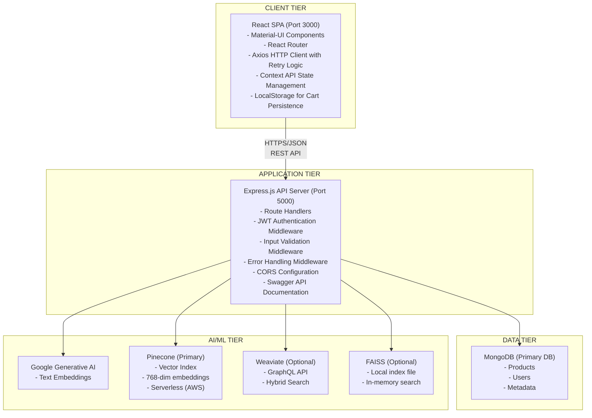
```mermaid
graph TB
    subgraph CLIENT["CLIENT TIER"]
        React["React SPA (Port 3000)<br/>- Material-UI Components<br/>- React Router<br/>- Axios HTTP Client with Retry Logic<br/>- Context API State Management<br/>- LocalStorage for Cart Persistence"]
    end

    subgraph APPLICATION["APPLICATION TIER"]
        Express["Express.js API Server (Port 5000)<br/>- Route Handlers<br/>- JWT Authentication Middleware<br/>- Input Validation Middleware<br/>- Error Handling Middleware<br/>- CORS Configuration<br/>- Swagger API Documentation"]
    end

    subgraph DATA["DATA TIER"]
        MongoDB["MongoDB (Primary DB)<br/>- Products<br/>- Users<br/>- Metadata"]
    end

    subgraph AI["AI/ML TIER"]
        GoogleAI["Google Generative AI<br/>- Text Embeddings"]
        Pinecone["Pinecone (Primary)<br/>- Vector Index<br/>- 768-dim embeddings<br/>- Serverless (AWS)"]
        Weaviate["Weaviate (Optional)<br/>- GraphQL API<br/>- Hybrid Search"]
        FAISS["FAISS (Optional)<br/>- Local index file<br/>- In-memory search"]
    end

    React -->|HTTPS/JSON<br/>REST API| Express
    Express --> MongoDB
    Express --> GoogleAI
    Express --> Pinecone
    Express --> Weaviate
    Express --> FAISS
```

### Request Flow

1. **User Interaction**: User interacts with React frontend
2. **API Request**: Axios sends HTTP request to Express backend
3. **Authentication**: JWT token verified by middleware (if required)
4. **Route Handler**: Express routes request to appropriate controller
5. **Business Logic**: Controller executes business logic
6. **Data Access**: Mongoose queries MongoDB
7. **Vector Operations** (if needed): Query Pinecone/Weaviate for recommendations
8. **Response**: JSON response sent back to client
9. **State Update**: React updates UI with new data

---

## Technology Stack

### Frontend Stack

| Layer | Technology | Version | Purpose |
|-------|------------|---------|---------|
| **Framework** | React | 18.3.1 | UI component library |
| **UI Library** | Material-UI | 5.15.20 | Pre-built components |
| **Routing** | React Router DOM | 6.23.1 | Client-side routing |
| **HTTP Client** | Axios | 1.7.2 | API communication |
| **State Management** | React Context + Hooks | Built-in | Global state |
| **Form Handling** | Native + Validation | Custom | Form processing |
| **Build Tool** | React Scripts + CRACO | 5.0.1 / 7.1.0 | Build configuration |
| **Testing** | Jest + RTL | 27.5.1 | Unit/integration tests |

### Backend Stack

| Layer | Technology | Version | Purpose |
|-------|------------|---------|---------|
| **Runtime** | Node.js | 18.x | JavaScript runtime |
| **Framework** | Express.js | 4.19.2 | Web application framework |
| **Database** | MongoDB | 6.x | Document database |
| **ODM** | Mongoose | 8.16.3 | MongoDB object modeling |
| **Authentication** | JWT + bcryptjs | 9.0.2 / 2.4.3 | Auth & hashing |
| **API Docs** | Swagger | Latest | Interactive API docs |
| **Testing** | Jest + Supertest | 30.0.4 / 7.1.1 | API testing |
| **Dev Server** | Nodemon | 3.1.4 | Hot-reloading |

### Vector Database Stack

| Technology | Version | Purpose |
|------------|---------|---------|
| **Pinecone** | Latest SDK | Primary vector search (production) |
| **Weaviate** | 3.6.2 | Secondary vector search (optional) |
| **FAISS** | 0.5.1 | Local vector search (development) |
| **Google AI** | 0.24.1 | Text embedding generation |
| **LangChain** | N/A | LLM integration framework |

### DevOps Stack

| Tool | Purpose |
|------|---------|
| **Docker** | Containerization |
| **Docker Compose** | Multi-container orchestration |
| **GitHub Actions** | CI/CD pipeline |
| **Vercel** | Frontend + API deployment |
| **Render** | Backup backend hosting |
| **MongoDB Atlas** | Cloud database hosting |
| **Pinecone Cloud** | Serverless vector database |

---

## System Components

### 1. Frontend Components

#### Page-Level Components
```
src/pages/
├── Home.jsx              # Landing page with featured products
├── Shop.jsx              # All products grid with filters
├── ProductDetails.jsx    # Single product view with recommendations
├── Cart.jsx              # Shopping cart management
├── Checkout.jsx          # Order checkout form
├── OrderSuccess.jsx      # Order confirmation
├── Login.jsx             # User login
├── Register.jsx          # User registration
├── ForgotPassword.jsx    # Password reset request
├── ResetPassword.jsx     # Password reset confirmation
├── About.jsx             # About page
├── Support.jsx           # Support/contact page
└── NotFoundPage.jsx      # 404 error page
```

#### Reusable Components
```
src/components/
├── NavigationBar.jsx     # Top navigation with search and cart badge
├── Footer.jsx            # Site footer with links
├── ProductCard.jsx       # Product tile (image, name, price, CTA)
├── CheckoutForm.jsx      # Payment form with credit card preview
├── SearchResults.jsx     # Search results display
└── ScrollToTop.jsx       # Auto-scroll utility component
```

#### Context Providers
```
src/context/
└── NotificationProvider.jsx  # Toast notification system
```

#### Services
```
src/services/
└── apiClient.js          # Axios instance with retry logic
```

#### Utilities
```
src/utils/
└── products.js           # Product data helper functions
```

### 2. Backend Components

#### Route Handlers
```
backend/routes/
├── products.js           # Product CRUD, recommendations, ratings
├── search.js             # Product search endpoint
├── checkout.js           # Order creation and validation
└── auth.js               # Authentication (login, register, password reset)
```

#### Database Models
```
backend/models/
├── product.js            # Product schema with vector sync hooks
└── user.js               # User schema with bcrypt hashing
```

#### Configuration
```
backend/config/
└── db.js                 # MongoDB connection configuration
```

#### Services
```
backend/services/
└── pineconeSync.js       # Pinecone synchronization helpers
```

#### Synchronization Modules
```
backend/sync/
├── syncPinecone.js       # Main Pinecone sync orchestrator
└── syncWeaviate.js       # Weaviate sync orchestrator
```

#### Vector Database Clients
```
backend/
├── pineconeClient.js     # Pinecone SDK wrapper
└── weaviateClient.js     # Weaviate SDK wrapper
```

#### Utility Scripts
```
backend/scripts/
├── build-faiss-index.js      # Build FAISS index from products
├── search-faiss-index.js     # Query FAISS index
├── sync-pinecone.js          # Full Pinecone sync script
├── sync-weaviate-ids.js      # Sync MongoDB IDs to Weaviate
├── query-weaviate.js         # Query Weaviate index
└── weaviate-upsert.js        # Upsert products to Weaviate
```

#### Database Seeding
```
backend/seed/
└── productSeeds.js       # Sample product data
```

#### API Documentation
```
backend/docs/
└── swagger.js            # Swagger/OpenAPI configuration
```

#### Testing
```
backend/__tests__/
├── auth.spec.js          # Authentication tests
├── checkout.spec.js      # Checkout tests
└── search.spec.js        # Search tests
```

---

## Data Flow Diagrams

### 1. Product Browsing Flow

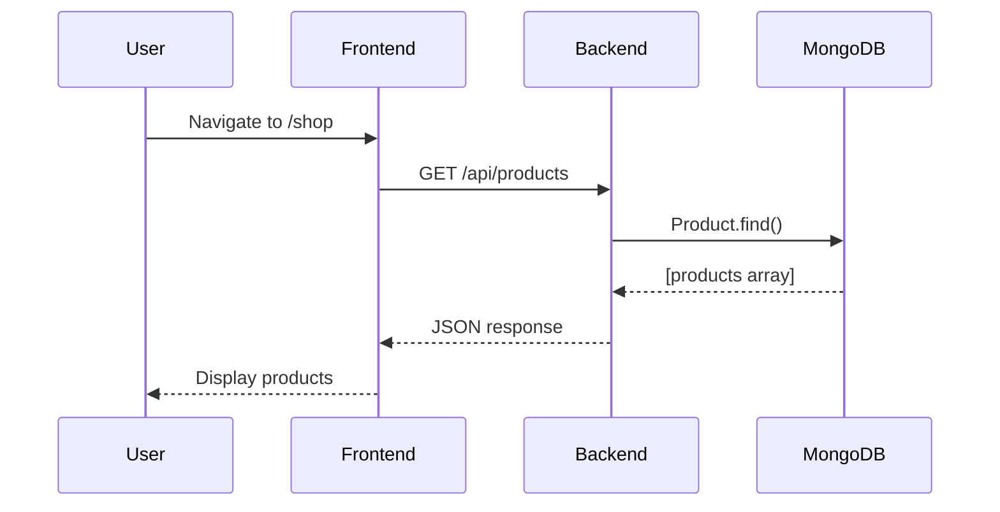
```mermaid
sequenceDiagram
    participant User
    participant Frontend
    participant Backend
    participant MongoDB

    User->>Frontend: Navigate to /shop
    Frontend->>Backend: GET /api/products
    Backend->>MongoDB: Product.find()
    MongoDB-->>Backend: [products array]
    Backend-->>Frontend: JSON response
    Frontend-->>User: Display products
```

### 2. Product Recommendation Flow

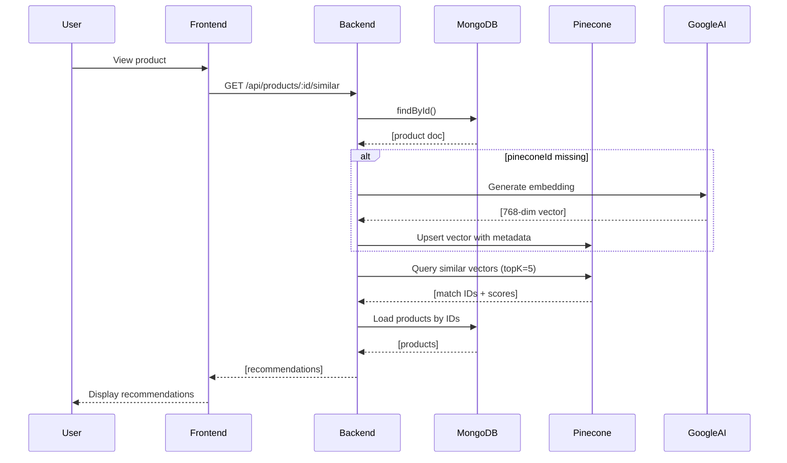
```mermaid
sequenceDiagram
    participant User
    participant Frontend
    participant Backend
    participant MongoDB
    participant Pinecone
    participant GoogleAI

    User->>Frontend: View product
    Frontend->>Backend: GET /api/products/:id/similar
    Backend->>MongoDB: findById()
    MongoDB-->>Backend: [product doc]

    alt pineconeId missing
        Backend->>GoogleAI: Generate embedding
        GoogleAI-->>Backend: [768-dim vector]
        Backend->>Pinecone: Upsert vector with metadata
    end

    Backend->>Pinecone: Query similar vectors (topK=5)
    Pinecone-->>Backend: [match IDs + scores]
    Backend->>MongoDB: Load products by IDs
    MongoDB-->>Backend: [products]
    Backend-->>Frontend: [recommendations]
    Frontend-->>User: Display recommendations
```

### 3. Checkout Flow

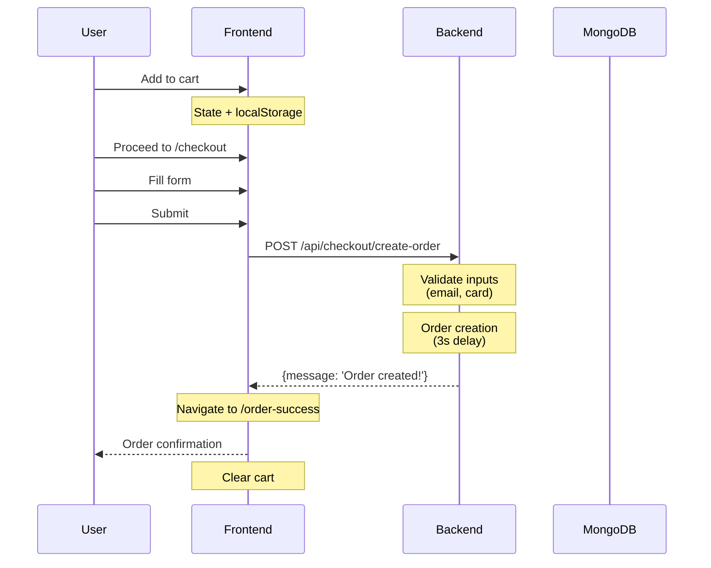
```mermaid
sequenceDiagram
    participant User
    participant Frontend
    participant Backend
    participant MongoDB

    User->>Frontend: Add to cart
    Note over Frontend: State + localStorage

    User->>Frontend: Proceed to /checkout
    User->>Frontend: Fill form
    User->>Frontend: Submit
    Frontend->>Backend: POST /api/checkout/create-order

    Note over Backend: Validate inputs<br/>(email, card)
    Note over Backend: Order creation<br/>(3s delay)

    Backend-->>Frontend: {message: 'Order created!'}
    Note over Frontend: Navigate to /order-success
    Frontend-->>User: Order confirmation
    Note over Frontend: Clear cart
```

### 4. Authentication Flow

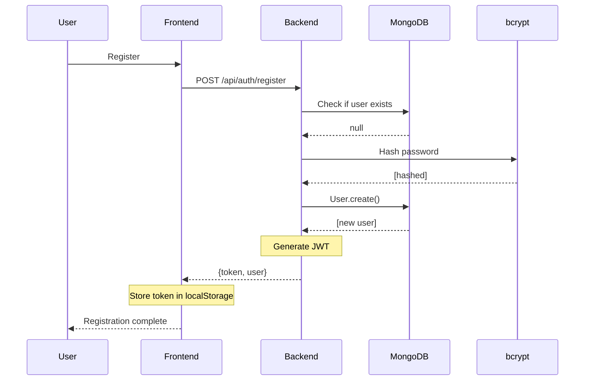
```mermaid
sequenceDiagram
    participant User
    participant Frontend
    participant Backend
    participant MongoDB
    participant bcrypt

    User->>Frontend: Register
    Frontend->>Backend: POST /api/auth/register
    Backend->>MongoDB: Check if user exists
    MongoDB-->>Backend: null

    Backend->>bcrypt: Hash password
    bcrypt-->>Backend: [hashed]

    Backend->>MongoDB: User.create()
    MongoDB-->>Backend: [new user]

    Note over Backend: Generate JWT

    Backend-->>Frontend: {token, user}
    Note over Frontend: Store token in localStorage
    Frontend-->>User: Registration complete
```

---

## Database Schema

### MongoDB Collections

#### Products Collection
```javascript
{
  _id: ObjectId,              // Auto-generated MongoDB ID
  name: String,               // Product name (required, unique)
  description: String,        // Product description (required)
  price: Number,              // Price in USD (required, min: 0)
  category: String,           // Category (e.g., "Laptops", "Phones")
  image: String,              // Image URL (required)
  brand: String,              // Brand name (optional)
  stock: Number,              // Available quantity (default: 0)
  rating: Number,             // Average rating (0-5, default: 0)
  numReviews: Number,         // Total reviews (default: 0)
  weaviateId: String,         // Weaviate UUID (optional, unique, sparse)
  pineconeId: String,         // Pinecone vector ID (optional, unique, sparse)
  createdAt: Date,            // Auto-timestamp (default: Date.now)
  updatedAt: Date             // Auto-updated by Mongoose
}
```

**Indexes:**
```javascript
// Single field indexes
db.products.createIndex({ name: 1 })
db.products.createIndex({ category: 1 })
db.products.createIndex({ brand: 1 })
db.products.createIndex({ rating: -1 })
db.products.createIndex({ createdAt: -1 })

// Compound indexes for recommendations
db.products.createIndex({ category: 1, rating: -1 })
db.products.createIndex({ brand: 1, price: 1 })

// Text search index
db.products.createIndex({ name: "text", description: "text" })

// Sparse indexes for vector IDs
db.products.createIndex({ pineconeId: 1 }, { unique: true, sparse: true })
db.products.createIndex({ weaviateId: 1 }, { unique: true, sparse: true })
```

#### Users Collection
```javascript
{
  _id: ObjectId,              // Auto-generated MongoDB ID
  name: String,               // Full name (required)
  email: String,              // Email address (required, unique, lowercase)
  password: String,           // Bcrypt hashed password (required)
  role: String,               // User role (default: "customer")
  createdAt: Date,            // Registration timestamp
  updatedAt: Date,            // Last update timestamp
  lastLogin: Date,            // Last login timestamp
  resetPasswordToken: String, // Password reset token (optional)
  resetPasswordExpires: Date  // Token expiry (optional)
}
```

**Indexes:**
```javascript
db.users.createIndex({ email: 1 }, { unique: true })
db.users.createIndex({ resetPasswordToken: 1 }, { sparse: true })
```

### Pinecone Vector Index

**Configuration:**
```yaml
Name: ecommerce-products
Dimension: 768
Metric: cosine
Cloud: AWS
Region: us-east-1
Environment: Serverless (free tier)
```

**Vector Structure:**
```javascript
{
  id: String,                 // Pinecone ID (usually MongoDB _id)
  values: Float32Array[768],  // Embedding vector from Google AI
  metadata: {
    mongoId: String,          // Reference to MongoDB _id
    name: String,             // Product name (for filtering)
    category: String,         // Product category
    brand: String,            // Product brand
    price: Number,            // Product price
    image: String             // Product image URL
  }
}
```

**Operations:**
- `upsert`: Add/update vectors
- `query`: Find similar vectors (cosine similarity)
- `fetch`: Retrieve vectors by ID
- `delete`: Remove vectors
- `delete_all` (via namespace): Purge all vectors

### Weaviate Schema (Optional)

**Class Definition:**
```json
{
  "class": "Product",
  "vectorizer": "text2vec-openai",
  "moduleConfig": {
    "text2vec-openai": {
      "model": "ada",
      "modelVersion": "002",
      "type": "text"
    }
  },
  "properties": [
    {
      "name": "mongoId",
      "dataType": ["string"],
      "description": "MongoDB ObjectId reference"
    },
    {
      "name": "name",
      "dataType": ["string"],
      "description": "Product name"
    },
    {
      "name": "description",
      "dataType": ["text"],
      "description": "Product description"
    },
    {
      "name": "category",
      "dataType": ["string"],
      "description": "Product category"
    },
    {
      "name": "brand",
      "dataType": ["string"],
      "description": "Product brand"
    },
    {
      "name": "price",
      "dataType": ["number"],
      "description": "Product price in USD"
    },
    {
      "name": "image",
      "dataType": ["string"],
      "description": "Product image URL"
    }
  ]
}
```

---

## API Architecture

### REST API Design

**Base URL**: `http://localhost:5000/api` (development)
**Production**: `https://fusion-electronics-api.vercel.app/api`

### Endpoints

#### Products API

| Method | Endpoint | Description | Auth Required |
|--------|----------|-------------|---------------|
| GET | `/api/products` | List all products | No |
| GET | `/api/products/:id` | Get single product | No |
| GET | `/api/products/:id/similar` | Get 5 similar products | No |
| POST | `/api/products/recommendations` | Get 10 recommendations from IDs | No |
| GET | `/api/products/category/:category` | Filter by category | No |
| PUT | `/api/products/:id/rating` | Update product rating | No |

**Example Request:**
```http
GET /api/products/67890abc123def456789/similar HTTP/1.1
Host: localhost:5000
Accept: application/json
```

**Example Response:**
```json
[
  {
    "id": "67890abc123def456789",
    "name": "MacBook Pro 16-inch",
    "description": "High-performance laptop...",
    "price": 2499,
    "category": "Laptops",
    "image": "https://example.com/macbook.jpg",
    "brand": "Apple",
    "stock": 15,
    "rating": 4.8,
    "numReviews": 342,
    "createdAt": "2025-01-15T10:30:00.000Z"
  }
]
```

#### Search API

| Method | Endpoint | Description | Auth Required |
|--------|----------|-------------|---------------|
| GET | `/api/search?q=<query>` | Search products by keyword | No |

**Example:**
```http
GET /api/search?q=macbook HTTP/1.1
```

#### Checkout API

| Method | Endpoint | Description | Auth Required |
|--------|----------|-------------|---------------|
| POST | `/api/checkout/create-order` | Create order | No |

**Request Body:**
```json
{
  "items": [
    {
      "productId": "67890abc123def456789",
      "quantity": 2
    }
  ],
  "name": "John Doe",
  "email": "john@example.com",
  "shippingAddress": "123 Main St, City, State 12345",
  "cardNumber": "4111111111111111",
  "cardName": "JOHN DOE",
  "expiry": "12/25",
  "cvc": "123"
}
```

**Response:**
```json
{
  "message": "Order created successfully!"
}
```

#### Authentication API

| Method | Endpoint | Description | Auth Required |
|--------|----------|-------------|---------------|
| POST | `/api/auth/register` | Create user account | No |
| POST | `/api/auth/login` | Authenticate user | No |
| POST | `/api/auth/forgot-password` | Request password reset | No |
| POST | `/api/auth/reset-password` | Reset password with token | No |

**Register Request:**
```json
{
  "name": "Jane Smith",
  "email": "jane@example.com",
  "password": "SecureP@ssw0rd"
}
```

**Register Response:**
```json
{
  "token": "eyJhbGciOiJIUzI1NiIsInR5cCI6IkpXVCJ9...",
  "user": {
    "id": "67890abc123def456789",
    "name": "Jane Smith",
    "email": "jane@example.com",
    "role": "customer"
  }
}
```

### API Error Handling

**Standard Error Response:**
```json
{
  "error": "Error message describing what went wrong",
  "statusCode": 400,
  "details": {
    "field": "email",
    "message": "Invalid email format"
  }
}
```

**HTTP Status Codes:**
- `200 OK`: Successful request
- `201 Created`: Resource created successfully
- `400 Bad Request`: Invalid input
- `401 Unauthorized`: Authentication required
- `404 Not Found`: Resource not found
- `500 Internal Server Error`: Server error

---

## Vector Database Architecture

### Embedding Generation Pipeline

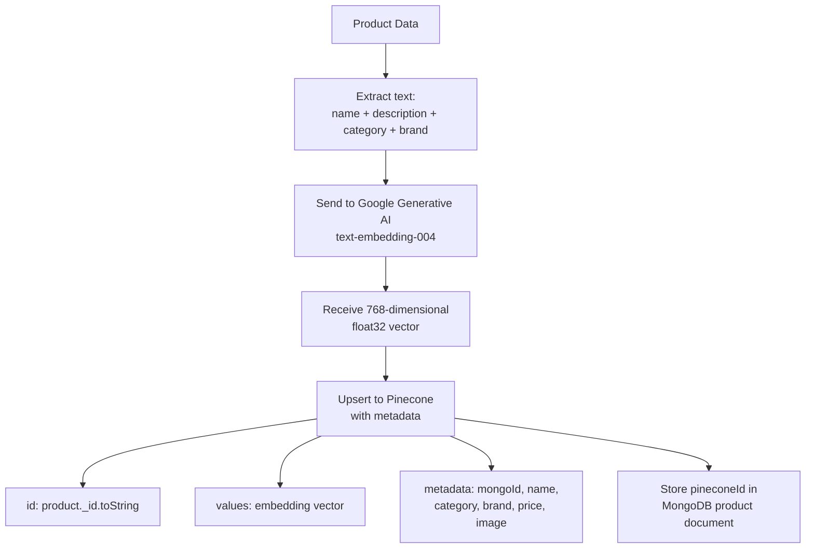
```mermaid
flowchart TD
    A[Product Data] --> B[Extract text:<br/>name + description + category + brand]
    B --> C[Send to Google Generative AI<br/>text-embedding-004]
    C --> D[Receive 768-dimensional<br/>float32 vector]
    D --> E[Upsert to Pinecone<br/>with metadata]
    E --> F[id: product._id.toString]
    E --> G[values: embedding vector]
    E --> H[metadata: mongoId, name,<br/>category, brand, price, image]
    E --> I[Store pineconeId in<br/>MongoDB product document]
```

### Vector Similarity Search

**Query by Product ID:**
```javascript
// 1. Fetch product from MongoDB
const product = await Product.findById(productId);

// 2. Query Pinecone using stored pineconeId
const result = await pineconeIndex.query({
  id: product.pineconeId,
  topK: 5,
  includeMetadata: true
});

// 3. Extract MongoDB IDs from matches
const mongoIds = result.matches.map(m => m.metadata.mongoId);

// 4. Load full product documents from MongoDB
const recommendations = await Product.find({ _id: { $in: mongoIds } });
```

**Query by Embedding Vector:**
```javascript
// 1. Generate embedding for search query
const queryEmbedding = await embedText("gaming laptop");

// 2. Query Pinecone using embedding vector
const result = await pineconeIndex.query({
  vector: queryEmbedding,
  topK: 10,
  includeMetadata: true
});

// 3. Load products from MongoDB
const products = await Product.find({
  _id: { $in: result.matches.map(m => m.metadata.mongoId) }
});
```

### Synchronization Strategy

**Trigger Points:**
1. **Server Startup**: Full sync of all products (`backend/index.js:36`)
2. **Product Creation**: Auto-sync on save hook (`backend/models/product.js:68`)
3. **Product Update**: Auto-sync if name/description/category/brand/price changes
4. **Product Deletion**: Auto-remove vector from Pinecone

**Sync Flow:**
```javascript
async function ensureProductSyncedWithPinecone(product) {
  // 1. Generate text representation
  const text = `${product.name} ${product.description} ${product.category} ${product.brand}`;

  // 2. Generate embedding
  const embedding = await embedText(text);

  // 3. Upsert to Pinecone
  const pineconeId = product._id.toString();
  await upsertVector(pineconeId, embedding, {
    mongoId: product._id.toString(),
    name: product.name,
    category: product.category,
    brand: product.brand,
    price: product.price,
    image: product.image
  });

  // 4. Update MongoDB with pineconeId
  if (product.pineconeId !== pineconeId) {
    product.pineconeId = pineconeId;
    await product.save();
  }
}
```

### Fallback Strategy

When vector search fails (e.g., Pinecone unavailable, no embeddings):

1. **Heuristic Scoring** (`backend/routes/products.js:62-76`):
   - Category match: +3 points
   - Brand match: +2 points
   - Name similarity (Jaccard): +3 points
   - Description similarity (Jaccard): +1 point
   - Price affinity: +2 points

2. **Ranking Fallback** (`backend/routes/products.js:21`):
   - Sort by: `rating DESC, numReviews DESC, createdAt DESC`

---

## Frontend Architecture

### Component Hierarchy

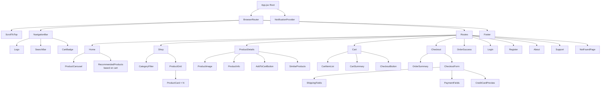
```mermaid
graph TB
    App[App.jsx Root]
    App --> BrowserRouter
    BrowserRouter --> ScrollToTop
    BrowserRouter --> NavigationBar
    BrowserRouter --> Routes
    BrowserRouter --> Footer
    App --> NotificationProvider

    NavigationBar --> Logo
    NavigationBar --> SearchBar
    NavigationBar --> CartBadge

    Routes --> Home
    Routes --> Shop
    Routes --> ProductDetails
    Routes --> Cart
    Routes --> Checkout
    Routes --> OrderSuccess
    Routes --> Login
    Routes --> Register
    Routes --> About
    Routes --> Support
    Routes --> NotFoundPage

    Home --> ProductCarousel
    Home --> RecommendedProducts[RecommendedProducts<br/>based on cart]

    Shop --> CategoryFilter
    Shop --> ProductGrid
    ProductGrid --> ProductCard[ProductCard × N]

    ProductDetails --> ProductImage
    ProductDetails --> ProductInfo
    ProductDetails --> AddToCartButton
    ProductDetails --> SimilarProducts

    Cart --> CartItemList
    Cart --> CartSummary
    Cart --> CheckoutButton

    Checkout --> OrderSummary
    Checkout --> CheckoutForm
    CheckoutForm --> ShippingFields
    CheckoutForm --> PaymentFields
    CheckoutForm --> CreditCardPreview
```

### State Management Strategy

#### Global State (React Context)
- **Cart**: `{ cart: Product[], setCart: Function }`
- **Products**: `{ products: Product[], loading: boolean, error: Error }`
- **Notifications**: `{ notify: Function }`

#### Local State (Component useState)
- Form inputs (name, email, password)
- UI toggles (modals, dropdowns)
- Loading states for async operations
- Search queries
- Pagination state

#### Persistent State (localStorage)
- Cart items: `localStorage.getItem('fusionCart')`
- JWT token: `localStorage.getItem('authToken')`
- User preferences (theme, language - future)

### Routing Strategy

**Client-Side Routing** (React Router DOM):
- `<BrowserRouter>`: Enables HTML5 history API
- `<Routes>`: Matches URL to components
- `<Route path="..." element={<Component />}>`: Defines routes
- `useNavigate()`: Programmatic navigation
- `useParams()`: Access URL parameters
- `useLocation()`: Access current location

**Route Protection** (Future Enhancement):
```jsx
function ProtectedRoute({ children }) {
  const token = localStorage.getItem('authToken');
  return token ? children : <Navigate to="/login" />;
}

<Route
  path="/account"
  element={
    <ProtectedRoute>
      <AccountPage />
    </ProtectedRoute>
  }
/>
```

### Data Fetching Strategy

**Axios Instance with Retry Logic** (`src/services/apiClient.js`):
```javascript
export const apiClient = axios.create({
  baseURL: process.env.REACT_APP_API_URL || '/api',
  timeout: 10000,
  headers: {
    'Content-Type': 'application/json'
  }
});

export async function withRetry(fn, maxRetries = 3) {
  let lastError;
  for (let i = 0; i < maxRetries; i++) {
    try {
      return await fn();
    } catch (error) {
      lastError = error;
      if (i < maxRetries - 1) {
        await new Promise(resolve => setTimeout(resolve, 1000 * (i + 1)));
      }
    }
  }
  throw lastError;
}
```

**Usage in Components:**
```jsx
useEffect(() => {
  const fetchProducts = async () => {
    try {
      const { data } = await withRetry(() => apiClient.get('/products'));
      setProducts(data);
    } catch (error) {
      notify({ severity: 'error', message: 'Failed to load products' });
    }
  };
  fetchProducts();
}, []);
```

---

## Authentication & Authorization

### JWT Token Structure

```javascript
// Payload
{
  userId: "67890abc123def456789",
  email: "user@example.com",
  role: "customer",
  iat: 1704067200,    // Issued at (Unix timestamp)
  exp: 1704153600     // Expires at (Unix timestamp, 24 hours later)
}

// Signature
HMACSHA256(
  base64UrlEncode(header) + "." + base64UrlEncode(payload),
  JWT_SECRET
)
```

### Authentication Flow

1. **Login/Register**:
   - User submits credentials
   - Backend verifies password with bcrypt
   - JWT token generated and returned
   - Frontend stores token in localStorage

2. **Authenticated Requests**:
   - Frontend includes token in Authorization header
   - Backend middleware verifies token
   - User data attached to `req.user`

3. **Token Expiration**:
   - Frontend checks expiry before requests
   - If expired, redirect to login
   - Backend returns 401 Unauthorized

**Middleware** (`backend/middleware/auth.js`):
```javascript
const jwt = require('jsonwebtoken');

function authMiddleware(req, res, next) {
  const token = req.header('Authorization')?.replace('Bearer ', '');

  if (!token) {
    return res.status(401).json({ error: 'Access denied' });
  }

  try {
    const decoded = jwt.verify(token, process.env.JWT_SECRET);
    req.user = decoded;
    next();
  } catch (error) {
    res.status(401).json({ error: 'Invalid token' });
  }
}
```

---

## Error Handling Strategy

### Backend Error Handling

**Global Error Handler** (`backend/index.js`):
```javascript
app.use((err, req, res, next) => {
  console.error('Error:', err);

  const statusCode = err.statusCode || 500;
  const message = err.message || 'Internal Server Error';

  res.status(statusCode).json({
    error: message,
    statusCode,
    ...(process.env.NODE_ENV === 'development' && { stack: err.stack })
  });
});
```

**Async Error Wrapper**:
```javascript
function asyncHandler(fn) {
  return (req, res, next) => {
    Promise.resolve(fn(req, res, next)).catch(next);
  };
}

router.get('/products/:id', asyncHandler(async (req, res) => {
  const product = await Product.findById(req.params.id);
  if (!product) throw new Error('Product not found');
  res.json(product);
}));
```

### Frontend Error Handling

**Try-Catch with Notifications**:
```jsx
const handleAddToCart = async (product) => {
  try {
    addToCart(product);
    notify({ severity: 'success', message: 'Added to cart!' });
  } catch (error) {
    notify({
      severity: 'error',
      message: error.response?.data?.error || 'Something went wrong'
    });
  }
};
```

**Error Boundaries** (Future Enhancement):
```jsx
class ErrorBoundary extends React.Component {
  state = { hasError: false };

  static getDerivedStateFromError(error) {
    return { hasError: true };
  }

  componentDidCatch(error, errorInfo) {
    console.error('Error caught:', error, errorInfo);
  }

  render() {
    if (this.state.hasError) {
      return <ErrorFallback />;
    }
    return this.props.children;
  }
}
```

---

## Performance Optimization

### Backend Optimizations

1. **Database Indexing**: Strategic indexes on frequently queried fields
2. **Lean Queries**: Use `.lean()` to return plain objects instead of Mongoose documents
3. **Connection Pooling**: MongoDB maintains connection pool automatically
4. **Caching** (Future): Redis for product catalog and recommendations
5. **Compression**: gzip compression for API responses

### Frontend Optimizations

1. **Code Splitting**: Dynamic imports for large components
2. **Lazy Loading**: Images loaded on-demand
3. **Memoization**: `React.memo`, `useMemo`, `useCallback` to prevent re-renders
4. **Bundle Optimization**: CRACO configuration for optimized builds
5. **API Request Batching**: Combine multiple requests when possible

### Vector Database Optimizations

1. **Batch Operations**: Upsert multiple vectors in single request
2. **Metadata Filtering**: Reduce result set with category/brand filters
3. **Namespace Organization**: Separate indexes per store (multi-tenancy)
4. **Caching**: Cache frequently accessed embeddings
5. **Hybrid Search**: Combine metadata filters with vector search

---

## Security Architecture

### Layers of Security

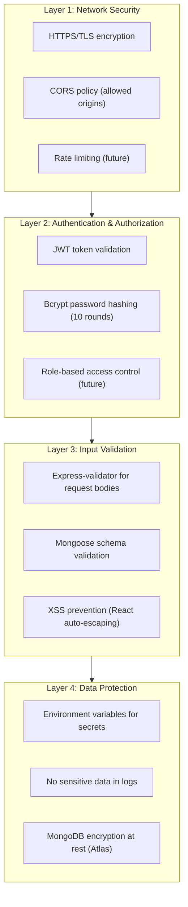
```mermaid
flowchart TB
    subgraph Layer1["Layer 1: Network Security"]
        L1A["HTTPS/TLS encryption"]
        L1B["CORS policy (allowed origins)"]
        L1C["Rate limiting (future)"]
    end

    subgraph Layer2["Layer 2: Authentication & Authorization"]
        L2A["JWT token validation"]
        L2B["Bcrypt password hashing (10 rounds)"]
        L2C["Role-based access control (future)"]
    end

    subgraph Layer3["Layer 3: Input Validation"]
        L3A["Express-validator for request bodies"]
        L3B["Mongoose schema validation"]
        L3C["XSS prevention (React auto-escaping)"]
    end

    subgraph Layer4["Layer 4: Data Protection"]
        L4A["Environment variables for secrets"]
        L4B["No sensitive data in logs"]
        L4C["MongoDB encryption at rest (Atlas)"]
    end

    Layer1 --> Layer2
    Layer2 --> Layer3
    Layer3 --> Layer4
```

### Security Best Practices Implemented

- ✅ Passwords hashed with bcryptjs (10 salt rounds)
- ✅ JWT tokens with expiration (24 hours)
- ✅ CORS configured for specific origins
- ✅ Environment variables for secrets (.env not committed)
- ✅ Input validation on checkout (email, card format)
- ✅ React XSS protection (auto-escaping)
- ✅ MongoDB injection protection (Mongoose sanitizes)
- ⚠️ HTTPS enforced in production only
- ⚠️ Rate limiting not yet implemented
- ⚠️ Content Security Policy not configured

---

## Deployment Architecture

### Development Environment

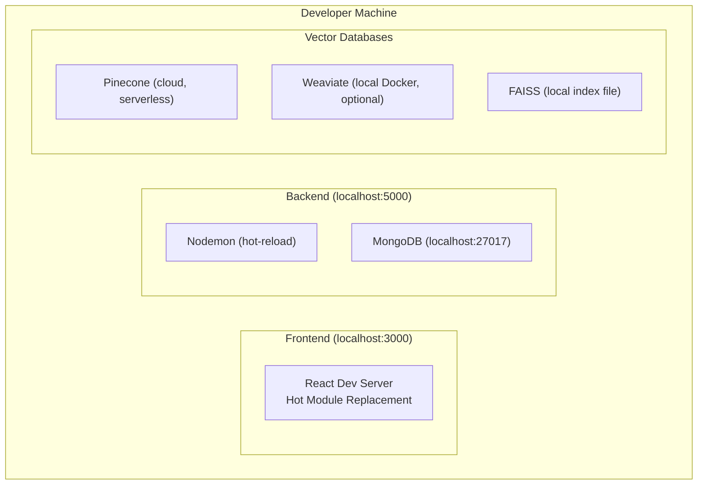
```mermaid
graph TB
    subgraph DevMachine["Developer Machine"]
        subgraph Frontend["Frontend (localhost:3000)"]
            ReactDev["React Dev Server<br/>Hot Module Replacement"]
        end

        subgraph Backend["Backend (localhost:5000)"]
            Nodemon["Nodemon (hot-reload)"]
            MongoLocal["MongoDB (localhost:27017)"]
        end

        subgraph VectorDBs["Vector Databases"]
            PineconeDev["Pinecone (cloud, serverless)"]
            WeaviateDev["Weaviate (local Docker, optional)"]
            FAISSDev["FAISS (local index file)"]
        end
    end
```

### Production Environment (Serverless)

The production deployment leverages Vercel for frontend and API routes, with Render as a backup backend. MongoDB Atlas and Pinecone provide managed database services.

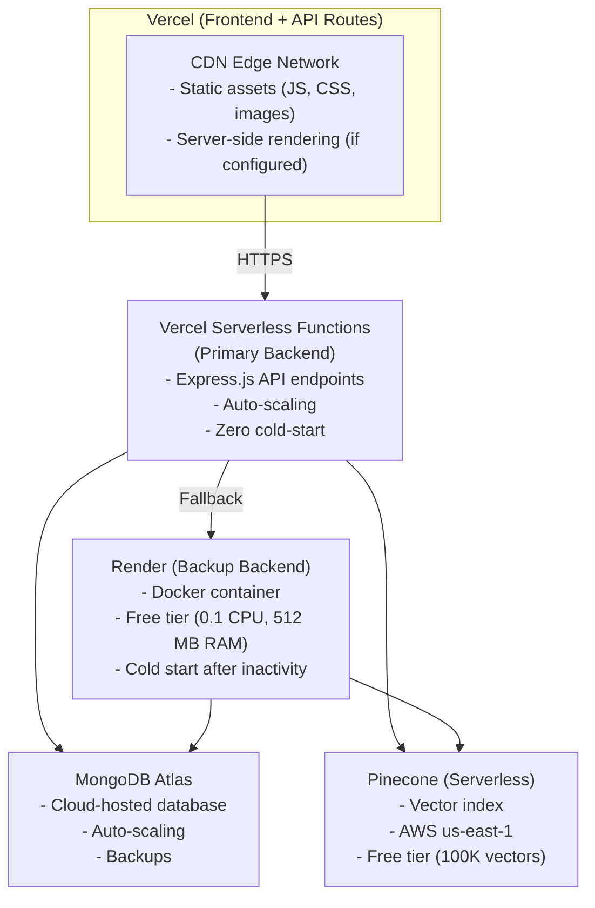
```mermaid
graph TB
    subgraph Vercel["Vercel (Frontend + API Routes)"]
        CDN["CDN Edge Network<br/>- Static assets (JS, CSS, images)<br/>- Server-side rendering (if configured)"]
    end

    CDN -->|HTTPS| ServerlessFunctions["Vercel Serverless Functions<br/>(Primary Backend)<br/>- Express.js API endpoints<br/>- Auto-scaling<br/>- Zero cold-start"]

    ServerlessFunctions -->|Fallback| Render["Render (Backup Backend)<br/>- Docker container<br/>- Free tier (0.1 CPU, 512 MB RAM)<br/>- Cold start after inactivity"]

    ServerlessFunctions --> MongoDB["MongoDB Atlas<br/>- Cloud-hosted database<br/>- Auto-scaling<br/>- Backups"]
    ServerlessFunctions --> PineconeProd["Pinecone (Serverless)<br/>- Vector index<br/>- AWS us-east-1<br/>- Free tier (100K vectors)"]

    Render --> MongoDB
    Render --> PineconeProd
```

### Enterprise Kubernetes Deployment

Fusion Electronics also fully supports an enterprise-grade deployment architecture using Kubernetes for high availability, scalability, and advanced deployment strategies.

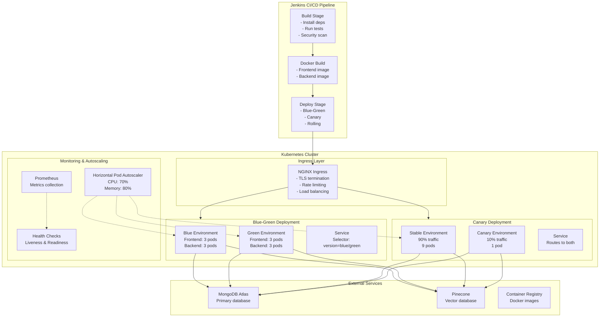
```mermaid
graph TB
    subgraph Jenkins["Jenkins CI/CD Pipeline"]
        Build["Build Stage<br/>- Install deps<br/>- Run tests<br/>- Security scan"]
        Docker["Docker Build<br/>- Frontend image<br/>- Backend image"]
        Deploy["Deploy Stage<br/>- Blue-Green<br/>- Canary<br/>- Rolling"]

        Build --> Docker
        Docker --> Deploy
    end

    subgraph K8s["Kubernetes Cluster"]
        subgraph Ingress["Ingress Layer"]
            NGINX["NGINX Ingress<br/>- TLS termination<br/>- Rate limiting<br/>- Load balancing"]
        end

        subgraph BlueGreen["Blue-Green Deployment"]
            BlueEnv["Blue Environment<br/>Frontend: 3 pods<br/>Backend: 3 pods"]
            GreenEnv["Green Environment<br/>Frontend: 3 pods<br/>Backend: 3 pods"]
            BGService["Service<br/>Selector: version=blue/green"]
        end

        subgraph Canary["Canary Deployment"]
            Stable["Stable Environment<br/>90% traffic<br/>9 pods"]
            CanaryEnv["Canary Environment<br/>10% traffic<br/>1 pod"]
            CanaryService["Service<br/>Routes to both"]
        end

        subgraph Monitoring["Monitoring & Autoscaling"]
            HPA["Horizontal Pod Autoscaler<br/>CPU: 70%<br/>Memory: 80%"]
            Prometheus["Prometheus<br/>Metrics collection"]
            HealthChecks["Health Checks<br/>Liveness & Readiness"]
        end
    end

    subgraph External["External Services"]
        MongoAtlas["MongoDB Atlas<br/>Primary database"]
        PineconeK8s["Pinecone<br/>Vector database"]
        Registry["Container Registry<br/>Docker images"]
    end

    Deploy --> NGINX
    NGINX --> BlueGreen
    NGINX --> Canary

    BlueEnv --> MongoAtlas
    GreenEnv --> MongoAtlas
    Stable --> MongoAtlas
    CanaryEnv --> MongoAtlas

    BlueEnv --> PineconeK8s
    GreenEnv --> PineconeK8s
    Stable --> PineconeK8s
    CanaryEnv --> PineconeK8s

    HPA -.-> BlueEnv
    HPA -.-> GreenEnv
    HPA -.-> Stable

    Prometheus -.-> HealthChecks
```

### Deployment Strategies

#### Blue-Green Deployment Architecture

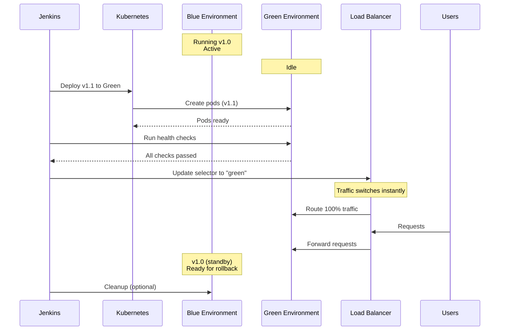
```mermaid
sequenceDiagram
    participant Jenkins
    participant K8s as Kubernetes
    participant Blue as Blue Environment
    participant Green as Green Environment
    participant Service as Load Balancer
    participant Users

    Note over Blue: Running v1.0<br/>Active
    Note over Green: Idle

    Jenkins->>K8s: Deploy v1.1 to Green
    K8s->>Green: Create pods (v1.1)
    Green-->>K8s: Pods ready

    Jenkins->>Green: Run health checks
    Green-->>Jenkins: All checks passed

    Jenkins->>Service: Update selector to "green"

    Note over Service: Traffic switches instantly

    Service->>Green: Route 100% traffic
    Users->>Service: Requests
    Service->>Green: Forward requests

    Note over Blue: v1.0 (standby)<br/>Ready for rollback

    Jenkins->>Blue: Cleanup (optional)
```

#### Canary Deployment Architecture

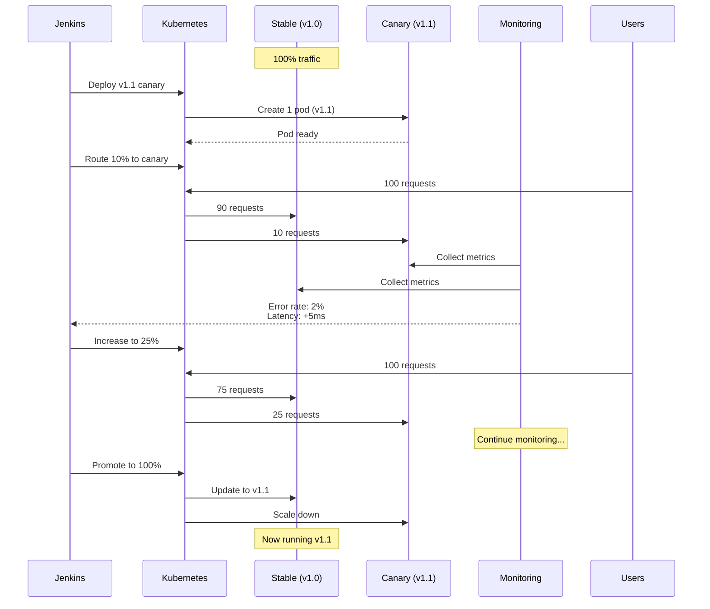
```mermaid
sequenceDiagram
    participant Jenkins
    participant K8s as Kubernetes
    participant Stable as Stable (v1.0)
    participant Canary as Canary (v1.1)
    participant Monitor as Monitoring
    participant Users

    Note over Stable: 100% traffic

    Jenkins->>K8s: Deploy v1.1 canary
    K8s->>Canary: Create 1 pod (v1.1)
    Canary-->>K8s: Pod ready

    Jenkins->>K8s: Route 10% to canary

    Users->>K8s: 100 requests
    K8s->>Stable: 90 requests
    K8s->>Canary: 10 requests

    Monitor->>Canary: Collect metrics
    Monitor->>Stable: Collect metrics
    Monitor-->>Jenkins: Error rate: 2%<br/>Latency: +5ms

    Jenkins->>K8s: Increase to 25%

    Users->>K8s: 100 requests
    K8s->>Stable: 75 requests
    K8s->>Canary: 25 requests

    Note over Monitor: Continue monitoring...

    Jenkins->>K8s: Promote to 100%
    K8s->>Stable: Update to v1.1
    K8s->>Canary: Scale down

    Note over Stable: Now running v1.1
```

### High Availability Architecture

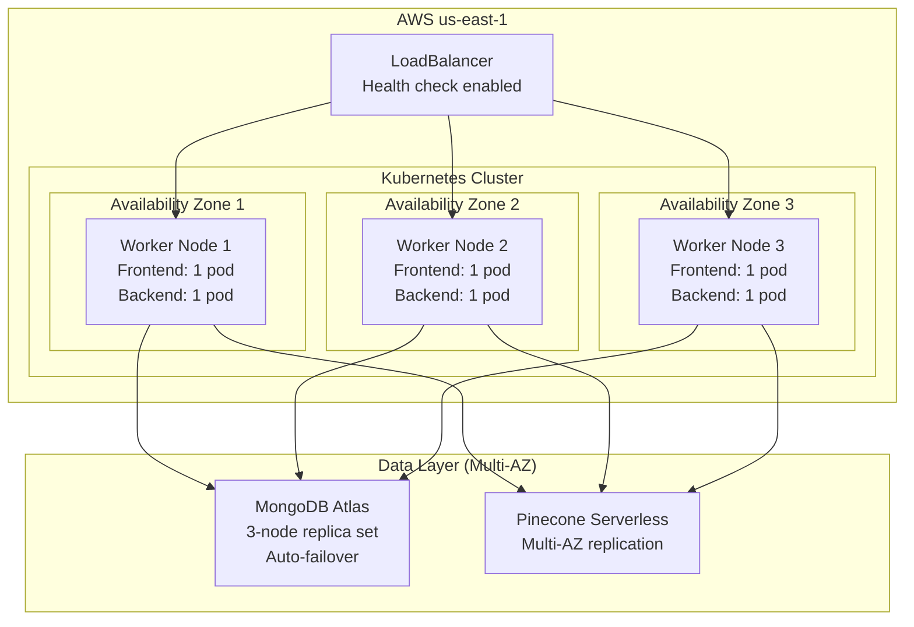
```mermaid
graph TB
    subgraph Region1["AWS us-east-1"]
        subgraph K8sCluster["Kubernetes Cluster"]
            subgraph Zone1["Availability Zone 1"]
                Node1["Worker Node 1<br/>Frontend: 1 pod<br/>Backend: 1 pod"]
            end

            subgraph Zone2["Availability Zone 2"]
                Node2["Worker Node 2<br/>Frontend: 1 pod<br/>Backend: 1 pod"]
            end

            subgraph Zone3["Availability Zone 3"]
                Node3["Worker Node 3<br/>Frontend: 1 pod<br/>Backend: 1 pod"]
            end
        end

        LB["LoadBalancer<br/>Health check enabled"]

        LB --> Node1
        LB --> Node2
        LB --> Node3
    end

    subgraph Data["Data Layer (Multi-AZ)"]
        MongoCluster["MongoDB Atlas<br/>3-node replica set<br/>Auto-failover"]
        PineconeIdx["Pinecone Serverless<br/>Multi-AZ replication"]
    end

    Node1 --> MongoCluster
    Node2 --> MongoCluster
    Node3 --> MongoCluster

    Node1 --> PineconeIdx
    Node2 --> PineconeIdx
    Node3 --> PineconeIdx
```

### CI/CD Pipeline (GitHub Actions)

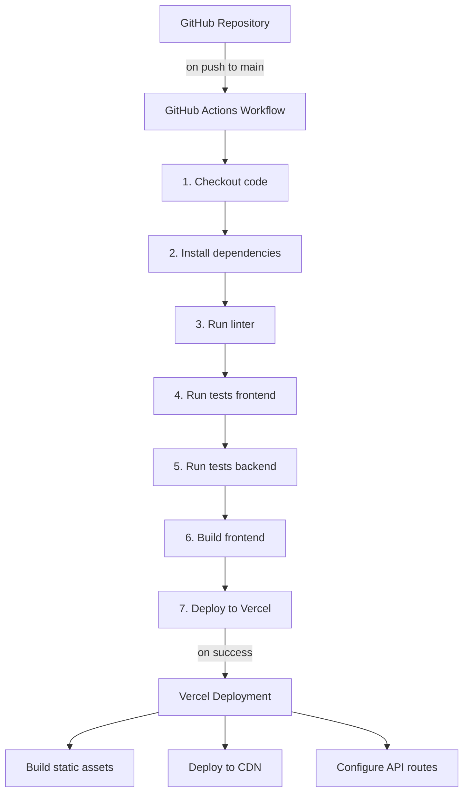
```mermaid
flowchart TD
    A[GitHub Repository] -->|on push to main| B[GitHub Actions Workflow]
    B --> C[1. Checkout code]
    C --> D[2. Install dependencies]
    D --> E[3. Run linter]
    E --> F[4. Run tests frontend]
    F --> G[5. Run tests backend]
    G --> H[6. Build frontend]
    H --> I[7. Deploy to Vercel]
    I -->|on success| J[Vercel Deployment]
    J --> K[Build static assets]
    J --> L[Deploy to CDN]
    J --> M[Configure API routes]
```

### CI/CD Pipeline (Jenkins - Kubernetes)

For enterprise Kubernetes deployments, a Jenkins pipeline can be used:

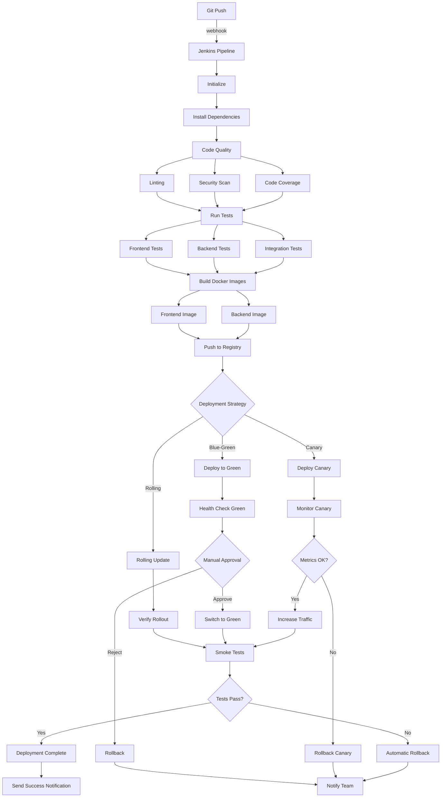
```mermaid
flowchart TD
    A[Git Push] -->|webhook| B[Jenkins Pipeline]

    B --> C[Initialize]
    C --> D[Install Dependencies]

    D --> E[Code Quality]
    E --> E1[Linting]
    E --> E2[Security Scan]
    E --> E3[Code Coverage]

    E1 --> F[Run Tests]
    E2 --> F
    E3 --> F

    F --> F1[Frontend Tests]
    F --> F2[Backend Tests]
    F --> F3[Integration Tests]

    F1 --> G[Build Docker Images]
    F2 --> G
    F3 --> G

    G --> G1[Frontend Image]
    G --> G2[Backend Image]

    G1 --> H[Push to Registry]
    G2 --> H

    H --> I{Deployment Strategy}

    I -->|Blue-Green| J1[Deploy to Green]
    I -->|Canary| J2[Deploy Canary]
    I -->|Rolling| J3[Rolling Update]

    J1 --> K1[Health Check Green]
    J2 --> K2[Monitor Canary]
    J3 --> K3[Verify Rollout]

    K1 --> L1{Manual Approval}
    K2 --> L2{Metrics OK?}
    K3 --> M[Smoke Tests]

    L1 -->|Approve| M1[Switch to Green]
    L1 -->|Reject| R1[Rollback]

    L2 -->|Yes| M2[Increase Traffic]
    L2 -->|No| R2[Rollback Canary]

    M1 --> M
    M2 --> M

    M --> N{Tests Pass?}

    N -->|Yes| O[Deployment Complete]
    N -->|No| R3[Automatic Rollback]

    R1 --> P[Notify Team]
    R2 --> P
    R3 --> P

    O --> Q[Send Success Notification]
```

### Deployment Infrastructure Components

| Component | Purpose | Technology | Configuration |
|-----------|---------|------------|---------------|
| **Container Registry** | Store Docker images | Docker Hub / ECR | Private registry with RBAC |
| **Kubernetes Cluster** | Orchestration platform | K8s v1.25+ | 3+ nodes, multi-AZ |
| **Ingress Controller** | Traffic routing & TLS | NGINX Ingress | Rate limiting, CORS enabled |
| **Load Balancer** | External access | Cloud LB | Health checks, session affinity |
| **Horizontal Pod Autoscaler** | Auto-scaling | K8s HPA | CPU 70%, Memory 80% |
| **Pod Disruption Budget** | High availability | K8s PDB | minAvailable: 2 |
| **Network Policies** | Security | K8s NetworkPolicy | Segmented traffic |
| **ConfigMaps** | Configuration | K8s ConfigMap | Non-sensitive config |
| **Secrets** | Credentials | K8s Secrets | MongoDB, Pinecone, JWT |
| **Persistent Volumes** | Data persistence | K8s PV/PVC | For logs, temporary data |

### Deployment Scripts Overview

| Script | Purpose | Usage |
|--------|---------|-------|
| `blue-green-deploy.sh` | Orchestrate blue-green deployment | `bash blue-green-deploy.sh deploy-green` |
| `canary-deploy.sh` | Manage canary deployment | `bash canary-deploy.sh deploy-canary` |
| `health-check.sh` | Comprehensive health validation | `bash health-check.sh green` |
| `monitor-canary.sh` | Real-time canary monitoring | `bash monitor-canary.sh` |
| `rollback.sh` | Automated rollback procedures | `bash rollback.sh auto` |
| `smoke-tests.sh` | Post-deployment smoke tests | `bash smoke-tests.sh` |
| `performance-tests.sh` | Load and performance testing | `bash performance-tests.sh` |

### Monitoring Architecture

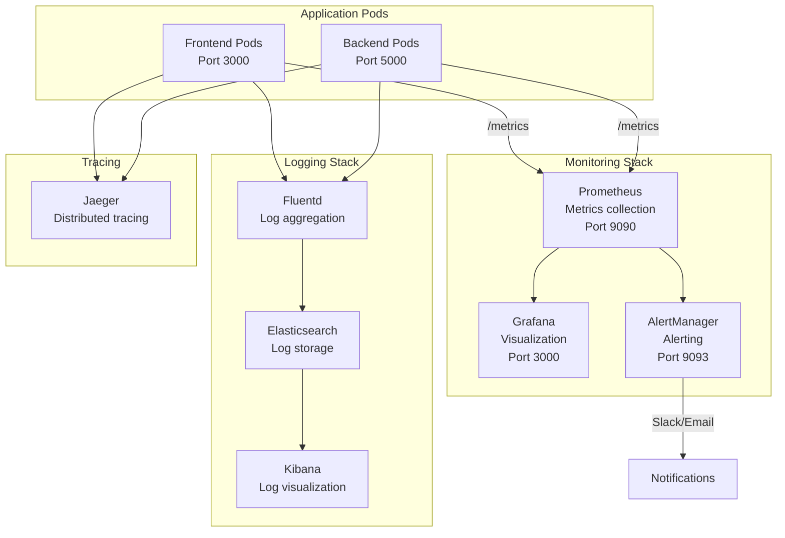
```mermaid
graph TB
    subgraph Apps["Application Pods"]
        Frontend["Frontend Pods<br/>Port 3000"]
        Backend["Backend Pods<br/>Port 5000"]
    end

    subgraph Monitoring["Monitoring Stack"]
        Prometheus["Prometheus<br/>Metrics collection<br/>Port 9090"]
        Grafana["Grafana<br/>Visualization<br/>Port 3000"]
        AlertManager["AlertManager<br/>Alerting<br/>Port 9093"]
    end

    subgraph Logging["Logging Stack"]
        Fluent["Fluentd<br/>Log aggregation"]
        Elastic["Elasticsearch<br/>Log storage"]
        Kibana["Kibana<br/>Log visualization"]
    end

    subgraph Tracing["Tracing"]
        Jaeger["Jaeger<br/>Distributed tracing"]
    end

    Frontend -->|/metrics| Prometheus
    Backend -->|/metrics| Prometheus

    Prometheus --> Grafana
    Prometheus --> AlertManager

    Frontend --> Fluent
    Backend --> Fluent
    Fluent --> Elastic
    Elastic --> Kibana

    Frontend --> Jaeger
    Backend --> Jaeger

    AlertManager -->|Slack/Email| Notifications["Notifications"]
```

### Rollback Strategies

| Strategy | Rollback Method | Time to Rollback | Data Consistency |
|----------|----------------|------------------|------------------|
| **Blue-Green** | Switch service selector to blue | Instant (< 5s) | No issues |
| **Canary** | Set traffic to 0%, scale down canary | < 30s | No issues |
| **Rolling** | `kubectl rollout undo` | 2-5 minutes | Potential mixed versions |

### Security Architecture

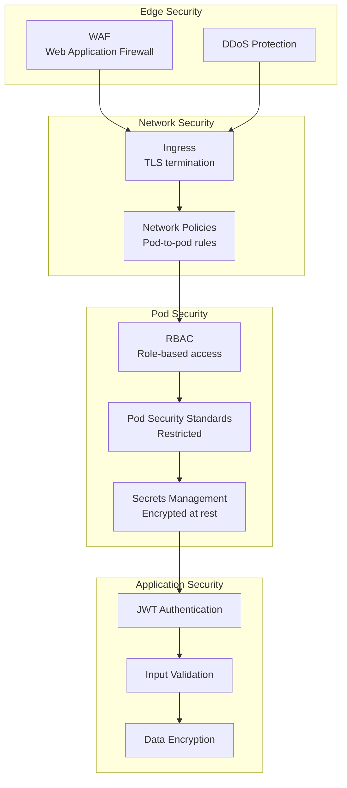
```mermaid
graph TB
    subgraph Edge["Edge Security"]
        WAF["WAF<br/>Web Application Firewall"]
        DDoS["DDoS Protection"]
    end

    subgraph Network["Network Security"]
        Ingress["Ingress<br/>TLS termination"]
        NetPol["Network Policies<br/>Pod-to-pod rules"]
    end

    subgraph Pod["Pod Security"]
        RBAC["RBAC<br/>Role-based access"]
        PodSec["Pod Security Standards<br/>Restricted"]
        Secrets["Secrets Management<br/>Encrypted at rest"]
    end

    subgraph App["Application Security"]
        Auth["JWT Authentication"]
        Input["Input Validation"]
        Encrypt["Data Encryption"]
    end

    WAF --> Ingress
    DDoS --> Ingress
    Ingress --> NetPol
    NetPol --> RBAC
    RBAC --> PodSec
    PodSec --> Secrets
    Secrets --> Auth
    Auth --> Input
    Input --> Encrypt
```

---

## Scalability Considerations

### Current Limitations

1. **MongoDB**: Single instance, no sharding (Atlas auto-scales)
2. **API Server**: Stateless design allows horizontal scaling
3. **Pinecone**: Serverless architecture, auto-scales
4. **Frontend**: CDN-based, globally distributed

### Scaling Strategy

#### Horizontal Scaling (Add More Instances)

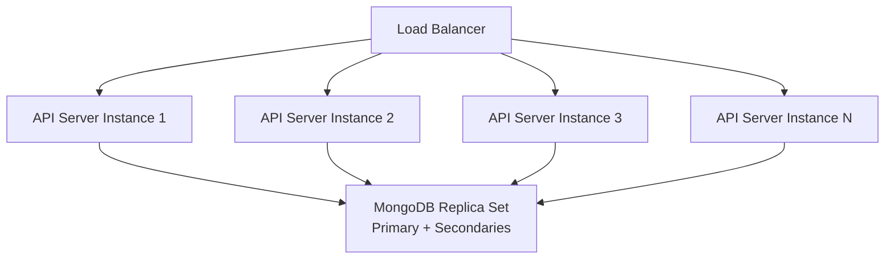
```mermaid
graph TB
    LB[Load Balancer] --> API1[API Server Instance 1]
    LB --> API2[API Server Instance 2]
    LB --> API3[API Server Instance 3]
    LB --> APIN[API Server Instance N]

    API1 --> MongoDB
    API2 --> MongoDB
    API3 --> MongoDB
    APIN --> MongoDB

    MongoDB[MongoDB Replica Set<br/>Primary + Secondaries]
```

#### Vertical Scaling (Increase Resources)

- Upgrade MongoDB Atlas tier (more CPU/RAM)
- Increase Render instance size
- Upgrade Pinecone plan for higher throughput

#### Database Sharding (Future)

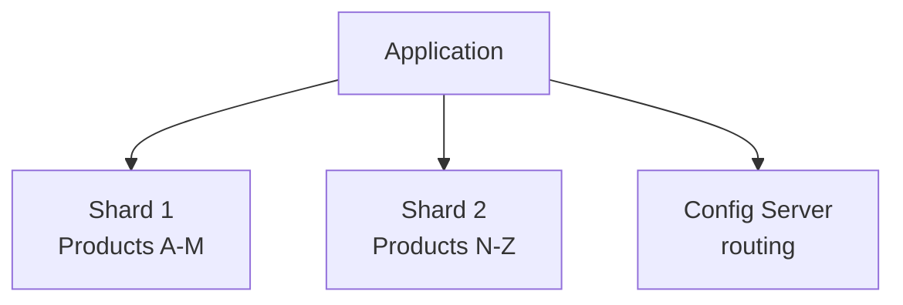
```mermaid
graph TB
    App[Application] --> Shard1[Shard 1<br/>Products A-M]
    App --> Shard2[Shard 2<br/>Products N-Z]
    App --> Config[Config Server<br/>routing]
```

#### Caching Layer (Future)

```mermaid
flowchart TD
    A[API Request] --> B{Redis Cache}
    B -->|hit| C[Return cached data]
    B -->|miss| D[Query MongoDB]
    D --> E[Store in cache]
    E --> F[Return data]
```

### Microservices Architecture (Future Evolution)

```mermaid
graph TB
    Gateway[API Gateway<br/>Kong / AWS API Gateway]
    Gateway --> ProductService[Product Service<br/>Node.js]
    Gateway --> UserService[User Service<br/>Node.js]
    Gateway --> OrderService[Order Service<br/>Node.js]
    Gateway --> RecommendService[Recommendation Service<br/>Python + FastAPI]
    Gateway --> SearchService[Search Service<br/>Elasticsearch]
```

---

## Monitoring & Logging

### Application Monitoring

**Current State:**
- Console logging in development
- Error logging to stdout/stderr in production

**Future Enhancements:**

1. **Application Performance Monitoring (APM)**:
   - New Relic / Datadog
   - Track API response times
   - Monitor database query performance
   - Identify bottlenecks

2. **Error Tracking**:
   - Sentry for frontend and backend
   - Real-time error alerts
   - Error grouping and trends

3. **Uptime Monitoring**:
   - UptimeRobot / Pingdom
   - Health check endpoints (`/health`)
   - Alert on downtime

### Logging Strategy

**Log Levels:**
- `ERROR`: Application errors, exceptions
- `WARN`: Potential issues, fallback activations
- `INFO`: Important state changes (DB connection, sync complete)
- `DEBUG`: Detailed execution flow (development only)

**Structured Logging** (Future):
```javascript
logger.info('Product recommendation generated', {
  productId: '67890abc123def456789',
  method: 'pinecone',
  resultsCount: 5,
  latencyMs: 87,
  userId: req.user?.id
});
```

### Metrics to Track

1. **API Metrics**:
   - Request rate (requests/second)
   - Response time (p50, p95, p99)
   - Error rate (4xx, 5xx)
   - Throughput (MB/second)

2. **Database Metrics**:
   - Query execution time
   - Connection pool usage
   - Document scan ratio
   - Index hit rate

3. **Vector Database Metrics**:
   - Query latency
   - Embedding generation time
   - Cache hit rate
   - Sync duration

4. **Business Metrics**:
   - Products viewed
   - Cart additions
   - Checkout completions
   - Recommendation click-through rate

---

## Conclusion

This architecture documentation provides a comprehensive overview of the Fusion Electronics e-commerce platform. The system is designed with modern best practices, emphasizing:

- **Modularity**: Clear separation of concerns
- **Scalability**: Stateless design ready for horizontal scaling
- **Resilience**: Fallback mechanisms for critical features
- **Performance**: Optimized data fetching and caching strategies
- **Security**: Multi-layer security approach
- **Maintainability**: Well-structured codebase with comprehensive testing
