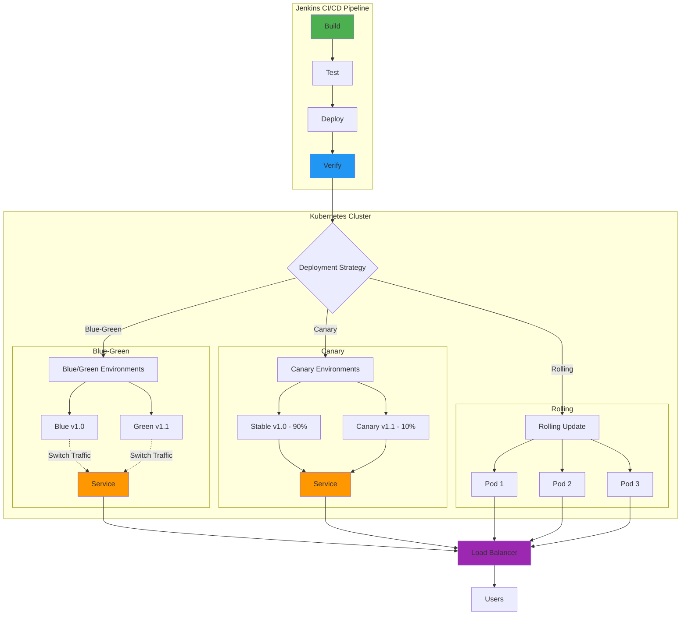
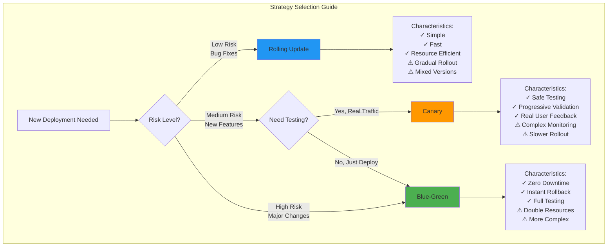
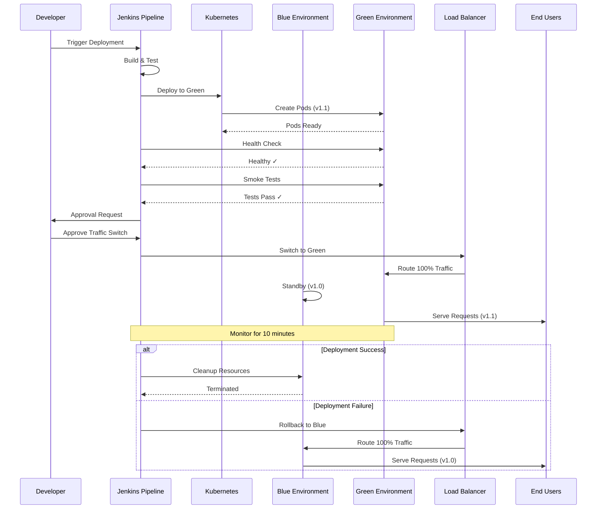
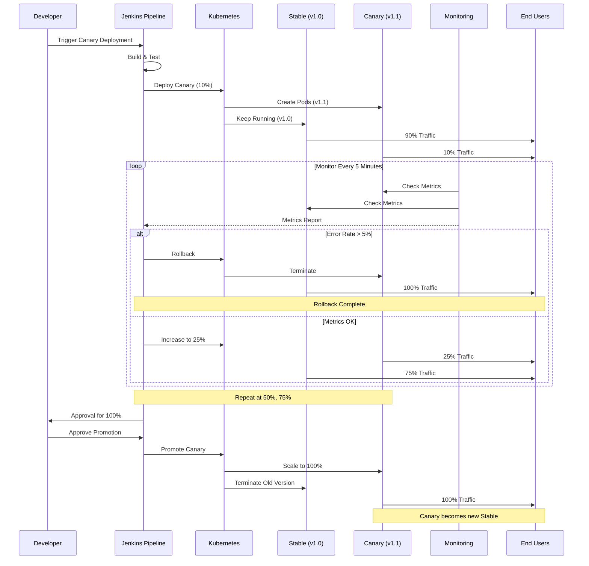
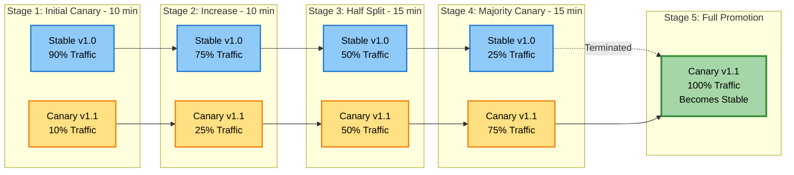
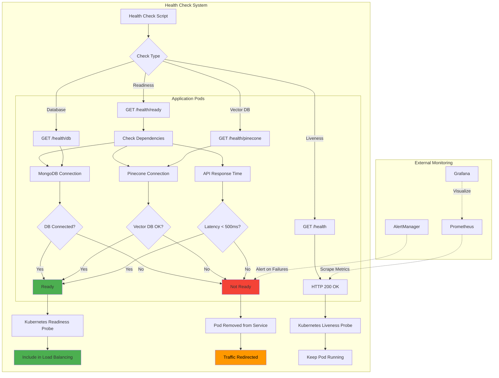
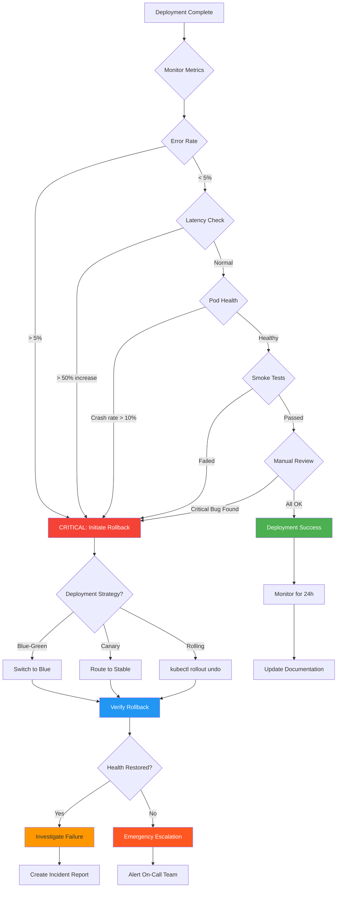
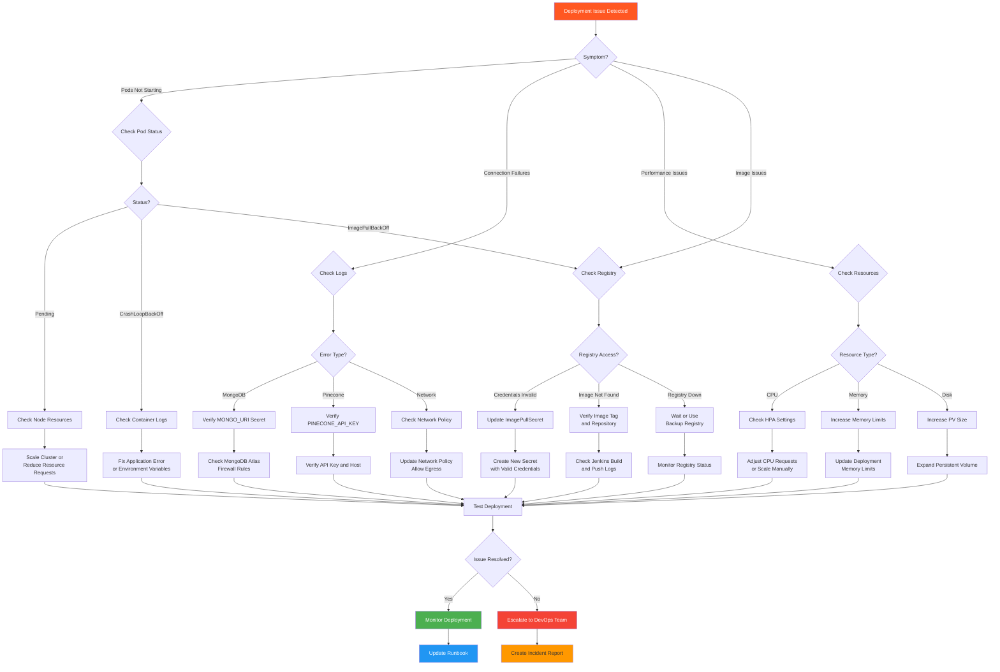

# Fusion Electronics - Deployment Guide

This comprehensive guide covers all deployment strategies, infrastructure setup, and operational procedures for the Fusion Electronics application.

## Table of Contents

1. [Overview](#overview)
2. [Prerequisites](#prerequisites)
3. [Infrastructure Setup](#infrastructure-setup)
4. [Deployment Strategies](#deployment-strategies)
5. [CI/CD Pipeline](#cicd-pipeline)
6. [Monitoring and Observability](#monitoring-and-observability)
7. [Rollback Procedures](#rollback-procedures)
8. [Troubleshooting](#troubleshooting)
9. [Production Checklist](#production-checklist)

---

## Overview

Fusion Electronics supports three production-ready deployment strategies:

1. **Blue-Green Deployment**: Zero-downtime deployments with instant rollback capability
2. **Canary Deployment**: Gradual rollout with progressive traffic shifting
3. **Rolling Update**: Standard Kubernetes rolling update

### Architecture



### Deployment Strategy Comparison



---

## Prerequisites

### Required Tools

- **kubectl** (v1.25+): Kubernetes command-line tool
- **docker** (v20.10+): Container runtime
- **helm** (v3.0+): Kubernetes package manager (optional)
- **jenkins** (v2.400+): CI/CD automation server
- **git**: Version control
- **bash** (v4.0+): Shell scripting

### Infrastructure Requirements

- **Kubernetes Cluster**: v1.25+ with at least 3 nodes
- **Container Registry**: Docker Hub, ECR, GCR, or Azure ACR
- **MongoDB Atlas**: Cloud-hosted MongoDB instance
- **Pinecone**: Vector database account
- **Google AI API**: API key for embeddings

### Access Requirements

- Kubernetes cluster admin access
- Docker registry push permissions
- MongoDB Atlas connection string
- Pinecone API credentials
- Google AI API key

---

## Infrastructure Setup

### 1. Clone the Repository

```bash
git clone https://github.com/hoangsonww/MERN-Stack-Ecommerce-App.git
cd MERN-Stack-Ecommerce-App
```

### 2. Set Up Kubernetes Namespace

```bash
# Create namespace
kubectl apply -f deployment/k8s/namespace.yaml

# Verify namespace
kubectl get namespace fusion-ecommerce
```

### 3. Configure Secrets

```bash
# Create secrets from environment variables
kubectl create secret generic fusion-electronics-secrets \
  --from-literal=MONGO_URI='mongodb+srv://...' \
  --from-literal=JWT_SECRET='your-strong-secret-key' \
  --from-literal=PINECONE_API_KEY='your-pinecone-key' \
  --from-literal=PINECONE_HOST='https://your-index.pinecone.io' \
  --from-literal=GOOGLE_AI_API_KEY='your-google-ai-key' \
  -n fusion-ecommerce

# Verify secrets
kubectl get secrets -n fusion-ecommerce
```

### 4. Apply ConfigMaps

```bash
# Apply configuration
kubectl apply -f deployment/k8s/configmap.yaml

# Verify config
kubectl get configmap fusion-electronics-config -n fusion-ecommerce
```

### 5. Set Up Ingress Controller (Optional)

```bash
# Install NGINX Ingress Controller
kubectl apply -f https://raw.githubusercontent.com/kubernetes/ingress-nginx/controller-v1.8.1/deploy/static/provider/cloud/deploy.yaml

# Apply ingress rules
kubectl apply -f deployment/k8s/ingress.yaml
```

### 6. Configure Jenkins

#### Install Jenkins Plugins

- Kubernetes Plugin
- Docker Pipeline Plugin
- Git Plugin
- Pipeline Plugin
- Credentials Binding Plugin

#### Configure Credentials

Add the following credentials in Jenkins:

1. **docker-registry-url**: Container registry URL
2. **docker-credentials**: Registry username/password
3. **kubeconfig**: Kubernetes config file
4. **mongodb-uri**: MongoDB connection string
5. **pinecone-api-key**: Pinecone API key
6. **google-ai-api-key**: Google AI API key

#### Create Jenkins Pipeline

1. Create new Pipeline job
2. Configure Git repository URL
3. Set script path to `Jenkinsfile`
4. Enable parameters

### Kubernetes Infrastructure Architecture

```mermaid
graph TB
    subgraph "External Access"
        Users[End Users]
        DNS[DNS / Route53]
    end

    subgraph "Kubernetes Cluster"
        subgraph "Ingress Layer"
            Ingress[NGINX Ingress Controller]
            TLS[TLS Termination]
        end

        subgraph "Namespace: fusion-ecommerce"
            subgraph "Services"
                FrontendSvc[Frontend Service<br/>LoadBalancer]
                BackendSvc[Backend Service<br/>LoadBalancer]
            end

            subgraph "Frontend Deployment"
                FE1[Frontend Pod 1]
                FE2[Frontend Pod 2]
                FE3[Frontend Pod 3]
                FE_HPA[HPA<br/>Min: 3, Max: 10]
            end

            subgraph "Backend Deployment"
                BE1[Backend Pod 1]
                BE2[Backend Pod 2]
                BE3[Backend Pod 3]
                BE_HPA[HPA<br/>Min: 3, Max: 10]
            end

            subgraph "Configuration"
                ConfigMap[ConfigMap<br/>App Config]
                Secrets[Secrets<br/>Credentials]
            end

            subgraph "Network Security"
                NetPolicy[Network Policy<br/>Ingress/Egress Rules]
                PDB[Pod Disruption Budget<br/>Min Available: 2]
            end
        end

        subgraph "Monitoring"
            Prometheus[Prometheus<br/>Metrics Collection]
            Grafana[Grafana<br/>Visualization]
            AlertManager[AlertManager<br/>Alerting]
        end
    end

    subgraph "External Services"
        MongoDB[(MongoDB Atlas<br/>Primary Database)]
        Pinecone[(Pinecone<br/>Vector Database)]
        Registry[Container Registry<br/>Docker Hub / ECR]
    end

    Users --> DNS
    DNS --> Ingress
    Ingress --> TLS
    TLS --> FrontendSvc
    TLS --> BackendSvc

    FrontendSvc --> FE1
    FrontendSvc --> FE2
    FrontendSvc --> FE3

    BackendSvc --> BE1
    BackendSvc --> BE2
    BackendSvc --> BE3

    FE_HPA -.->|Scales| FE1
    FE_HPA -.->|Scales| FE2
    FE_HPA -.->|Scales| FE3

    BE_HPA -.->|Scales| BE1
    BE_HPA -.->|Scales| BE2
    BE_HPA -.->|Scales| BE3

    ConfigMap -.->|Config| FE1
    ConfigMap -.->|Config| BE1
    Secrets -.->|Secrets| BE1
    Secrets -.->|Secrets| BE2
    Secrets -.->|Secrets| BE3

    NetPolicy -.->|Restricts| FE1
    NetPolicy -.->|Restricts| BE1
    PDB -.->|Protects| FE1
    PDB -.->|Protects| BE1

    BE1 --> MongoDB
    BE2 --> MongoDB
    BE3 --> MongoDB

    BE1 --> Pinecone
    BE2 --> Pinecone
    BE3 --> Pinecone

    Prometheus -.->|Scrape| FE1
    Prometheus -.->|Scrape| BE1
    Grafana --> Prometheus
    AlertManager --> Prometheus

    Registry -.->|Pull Images| FE1
    Registry -.->|Pull Images| BE1

    style Users fill:#9C27B0
    style Ingress fill:#FF9800
    style FrontendSvc fill:#2196F3
    style BackendSvc fill:#2196F3
    style MongoDB fill:#4CAF50
    style Pinecone fill:#4CAF50
    style Prometheus fill:#FF5722
```



---

## Deployment Strategies

### Blue-Green Deployment

Zero-downtime deployment by maintaining two identical environments (Blue and Green) and switching traffic between them.

#### When to Use

- Critical production releases
- When instant rollback is required
- For database schema changes
- During peak traffic hours

#### Deployment Process

```bash
# 1. Deploy to Green environment
bash deployment/scripts/blue-green-deploy.sh deploy-green

# 2. Run health checks
bash deployment/scripts/health-check.sh green

# 3. Run smoke tests
bash deployment/scripts/smoke-tests.sh

# 4. Switch traffic to Green
bash deployment/scripts/blue-green-deploy.sh switch-to-green

# 5. Verify deployment
bash deployment/scripts/health-check.sh green

# 6. Clean up Blue environment
bash deployment/scripts/blue-green-deploy.sh cleanup-blue
```

#### Jenkins Pipeline

```groovy
pipeline {
    agent any
    parameters {
        choice(name: 'DEPLOYMENT_STRATEGY', choices: ['blue-green'])
    }
    stages {
        stage('Deploy to Green') {
            steps {
                sh 'bash deployment/scripts/blue-green-deploy.sh deploy-green'
            }
        }
        stage('Health Check') {
            steps {
                sh 'bash deployment/scripts/health-check.sh green'
            }
        }
        stage('Switch Traffic') {
            input {
                message "Switch traffic to Green?"
            }
            steps {
                sh 'bash deployment/scripts/blue-green-deploy.sh switch-to-green'
            }
        }
    }
}
```

#### Rollback

```bash
# Instant rollback to Blue environment
bash deployment/scripts/blue-green-deploy.sh switch-to-blue
```

#### Blue-Green Deployment Flow



### Canary Deployment

Gradual rollout by routing a small percentage of traffic to the new version before full promotion.

#### When to Use

- Testing new features with real traffic
- Performance validation
- A/B testing scenarios
- Risk mitigation for major releases

#### Deployment Process

```bash
# 1. Deploy canary (10% traffic)
export CANARY_PERCENTAGE=10
bash deployment/scripts/canary-deploy.sh deploy-canary

# 2. Monitor canary for 5 minutes
bash deployment/scripts/monitor-canary.sh

# 3. Gradually increase traffic
export CANARY_PERCENTAGE=25
bash deployment/scripts/canary-deploy.sh deploy-canary

# Monitor again
bash deployment/scripts/monitor-canary.sh

# 4. Continue increasing (50%, 75%, 100%)
# ... repeat monitoring at each step ...

# 5. Promote canary to stable
bash deployment/scripts/canary-deploy.sh promote-canary

# 6. Clean up old deployment
bash deployment/scripts/canary-deploy.sh cleanup-old
```

#### Traffic Distribution Strategy

| Stage | Canary % | Stable % | Duration | Action |
|-------|----------|----------|----------|--------|
| 1 | 10% | 90% | 10 min | Monitor error rate, latency |
| 2 | 25% | 75% | 10 min | Compare metrics vs stable |
| 3 | 50% | 50% | 15 min | Performance testing |
| 4 | 75% | 25% | 15 min | Final validation |
| 5 | 100% | 0% | - | Promote to stable |

#### Rollback

```bash
# Immediate rollback to stable
bash deployment/scripts/canary-deploy.sh rollback
```

#### Monitoring Metrics

During canary deployment, monitor:

- **Error Rate**: Should not exceed 5%
- **Latency (p95)**: Should not exceed stable + 20%
- **Request Rate**: Verify traffic distribution
- **Pod Resource Usage**: CPU and memory
- **Business Metrics**: Conversion rate, revenue impact

#### Canary Deployment Flow



#### Traffic Distribution Visualization



### Rolling Update

Standard Kubernetes rolling update strategy.

#### When to Use

- Minor updates and patches
- Non-critical releases
- Stateless application updates

#### Deployment Process

```bash
# Update deployment image
kubectl set image deployment/fusion-electronics-frontend \
  frontend=registry.io/fusion-electronics-frontend:v1.2.0 \
  -n fusion-ecommerce

# Watch rollout status
kubectl rollout status deployment/fusion-electronics-frontend -n fusion-ecommerce
```

#### Rollback

```bash
# Rollback to previous version
kubectl rollout undo deployment/fusion-electronics-frontend -n fusion-ecommerce
```

---

## CI/CD Pipeline

### Pipeline Overview

```mermaid
graph LR
    A[Git Push] --> B[Jenkins Webhook]
    B --> C{Pipeline Start}

    C --> D[Initialize]
    D --> E[Install Dependencies]
    E --> F[Code Quality]
    F --> G[Run Tests]

    G --> H{Tests Pass?}
    H -->|No| I[Notify Team]
    H -->|Yes| J[Build Images]

    J --> K[Security Scan]
    K --> L{Vulnerabilities?}
    L -->|Critical| I
    L -->|None/Low| M[Push to Registry]

    M --> N{Deployment Strategy}

    N -->|Blue-Green| O[Deploy to Green]
    N -->|Canary| P[Deploy Canary 10%]
    N -->|Rolling| Q[Rolling Update]

    O --> R[Health Check]
    P --> S[Monitor Metrics]
    Q --> T[Watch Rollout]

    R --> U{Healthy?}
    S --> V{Metrics OK?}
    T --> W{Rollout OK?}

    U -->|No| X[Auto Rollback]
    V -->|No| X
    W -->|No| X

    U -->|Yes| Y[Smoke Tests]
    V -->|Yes| Z[Increase Traffic]
    W -->|Yes| AA[Verify Deployment]

    Y --> AB{Tests Pass?}
    AB -->|No| X
    AB -->|Yes| AC[Switch Traffic]

    Z --> AD{100% Traffic?}
    AD -->|No| S
    AD -->|Yes| AA

    AC --> AE[Cleanup Old]
    AA --> AE

    AE --> AF[Send Notifications]
    X --> AF

    AF --> AG[Archive Artifacts]

    style H fill:#FFA726
    style L fill:#FFA726
    style U fill:#FFA726
    style V fill:#FFA726
    style W fill:#FFA726
    style AB fill:#FFA726
    style X fill:#F44336
    style AE fill:#4CAF50
    style AG fill:#2196F3
```



### Pipeline Stages

#### 1. Initialize

- Clean workspace
- Checkout code from Git
- Set build description

#### 2. Install Dependencies

- Frontend: `npm ci`
- Backend: `cd backend && npm ci`

#### 3. Code Quality

- Linting: `npm run lint`
- Security scan: `npm audit`
- Code coverage: `npm run test:coverage`

#### 4. Run Tests

- Frontend unit tests
- Backend unit tests
- Integration tests
- API tests

#### 5. Build Docker Images

- Build frontend image
- Build backend image
- Tag with build number and Git commit

#### 6. Push Images

- Login to container registry
- Push tagged images
- Push latest tag

#### 7. Deploy

- Execute chosen deployment strategy
- Run health checks
- Perform smoke tests

#### 8. Post-Deployment

- Send notifications
- Archive artifacts
- Clean up old images

### Pipeline Configuration

Edit `Jenkinsfile` to customize:

```groovy
environment {
    DOCKER_REGISTRY = '<your-registry>'
    APP_NAME = 'fusion-electronics'
    K8S_NAMESPACE = 'fusion-ecommerce'
}

parameters {
    choice(name: 'DEPLOYMENT_STRATEGY',
           choices: ['blue-green', 'canary', 'rolling'])
    choice(name: 'CANARY_PERCENTAGE',
           choices: ['10', '25', '50', '75', '100'])
}
```

### Triggering Deployments

#### Manual Trigger

1. Open Jenkins dashboard
2. Click "Build with Parameters"
3. Select deployment strategy
4. Click "Build"

#### Automatic Trigger (Git Push)

Configure webhook in Jenkins:

```bash
# GitHub webhook URL
https://your-jenkins-url/github-webhook/

# Events to trigger:
- Push to main branch
- Pull request merge
```

---

## Monitoring and Observability

### Health Check Architecture



### Health Checks

#### Application Health

```bash
# Check all environments
bash deployment/scripts/health-check.sh all

# Check specific environment
bash deployment/scripts/health-check.sh blue
bash deployment/scripts/health-check.sh green
bash deployment/scripts/health-check.sh canary
```

#### Kubernetes Resources

```bash
# Check pods
kubectl get pods -n fusion-ecommerce

# Check deployments
kubectl get deployments -n fusion-ecommerce

# Check services
kubectl get services -n fusion-ecommerce

# Check resource usage
kubectl top pods -n fusion-ecommerce
kubectl top nodes
```

### Smoke Tests

```bash
# Run comprehensive smoke tests
bash deployment/scripts/smoke-tests.sh
```

Tests include:
- Frontend accessibility
- API endpoint health
- Database connectivity
- Vector database connectivity
- Authentication workflow
- Checkout workflow
- Error handling

#### Smoke Test Execution Flow


### Performance Tests

```bash
# Run performance tests
bash deployment/scripts/performance-tests.sh
```

Metrics:
- Request throughput
- Response time (p50, p95, p99)
- Error rate
- Concurrent users

### Logs

```bash
# Frontend logs
kubectl logs -f deployment/fusion-electronics-frontend -n fusion-ecommerce

# Backend logs
kubectl logs -f deployment/fusion-electronics-backend -n fusion-ecommerce

# Stream logs from all pods
kubectl logs -f -l app=fusion-electronics -n fusion-ecommerce
```

### Metrics (Prometheus)

```bash
# Port-forward Prometheus
kubectl port-forward -n monitoring svc/prometheus-server 9090:80

# Access at http://localhost:9090
```

Key metrics:
- `http_requests_total`
- `http_request_duration_seconds`
- `pod_cpu_usage`
- `pod_memory_usage`

---

## Rollback Procedures

### Rollback Decision Flow



### Automatic Rollback

Configured in Jenkinsfile - automatically triggers on deployment failure:

```groovy
post {
    failure {
        script {
            sh 'bash deployment/scripts/rollback.sh'
        }
    }
}
```

### Manual Rollback

#### Blue-Green Rollback

```bash
# Switch back to previous environment
bash deployment/scripts/blue-green-deploy.sh switch-to-blue
```

#### Canary Rollback

```bash
# Rollback canary deployment
bash deployment/scripts/canary-deploy.sh rollback
```

#### Rolling Update Rollback

```bash
# Kubectl rollback
kubectl rollout undo deployment/fusion-electronics-frontend -n fusion-ecommerce
kubectl rollout undo deployment/fusion-electronics-backend -n fusion-ecommerce
```

#### Auto-Detect Rollback

```bash
# Automatically detect strategy and rollback
bash deployment/scripts/rollback.sh auto
```

### Rollback Verification

```bash
# Verify rollback success
bash deployment/scripts/health-check.sh stable
bash deployment/scripts/smoke-tests.sh
```

---

## Troubleshooting

### Troubleshooting Flowchart



### Common Issues

#### 1. Pods Not Starting

**Symptoms**: Pods stuck in `Pending` or `CrashLoopBackOff`

**Diagnosis**:
```bash
kubectl describe pod <pod-name> -n fusion-ecommerce
kubectl logs <pod-name> -n fusion-ecommerce
```

**Solutions**:
- Check resource limits (CPU/memory)
- Verify image pull secrets
- Check environment variables
- Review liveness/readiness probes

#### 2. Database Connection Failures

**Symptoms**: Backend health checks failing

**Diagnosis**:
```bash
kubectl logs -f deployment/fusion-electronics-backend -n fusion-ecommerce | grep "MongoDB"
```

**Solutions**:
- Verify `MONGO_URI` secret
- Check MongoDB Atlas firewall rules
- Test connection from pod:
  ```bash
  kubectl exec -it <pod-name> -n fusion-ecommerce -- sh
  curl -v <mongo-uri>
  ```

#### 3. Canary Traffic Not Routing

**Symptoms**: Canary receives 0% traffic

**Diagnosis**:
```bash
kubectl get services -n fusion-ecommerce
kubectl describe service fusion-electronics-frontend -n fusion-ecommerce
```

**Solutions**:
- Verify service selector doesn't specify version
- Check replica counts
- If using Istio, verify VirtualService configuration

#### 4. Image Pull Errors

**Symptoms**: `ImagePullBackOff` errors

**Diagnosis**:
```bash
kubectl describe pod <pod-name> -n fusion-ecommerce
```

**Solutions**:
- Verify image name and tag
- Check registry credentials
- Ensure image exists in registry
- Create/update ImagePullSecret:
  ```bash
  kubectl create secret docker-registry registry-credentials \
    --docker-server=<registry> \
    --docker-username=<username> \
    --docker-password=<password> \
    -n fusion-ecommerce
  ```

### Debug Commands

```bash
# Get all resources
kubectl get all -n fusion-ecommerce

# Describe pod
kubectl describe pod <pod-name> -n fusion-ecommerce

# Get pod logs
kubectl logs <pod-name> -n fusion-ecommerce

# Execute command in pod
kubectl exec -it <pod-name> -n fusion-ecommerce -- sh

# Port forward for local testing
kubectl port-forward service/fusion-electronics-frontend 3000:80 -n fusion-ecommerce

# Get events
kubectl get events -n fusion-ecommerce --sort-by='.lastTimestamp'
```

---

## Production Checklist

Before deploying to production, verify:

### Pre-Deployment

- [ ] All tests passing (unit, integration, e2e)
- [ ] Security scan completed (no high vulnerabilities)
- [ ] Environment variables configured
- [ ] Secrets created in Kubernetes
- [ ] Database migration scripts ready (if applicable)
- [ ] Monitoring and alerting configured
- [ ] Rollback plan documented
- [ ] Team notified of deployment window

### During Deployment

- [ ] Monitor logs in real-time
- [ ] Watch pod status and health checks
- [ ] Verify database connectivity
- [ ] Check application metrics
- [ ] Run smoke tests
- [ ] Verify traffic routing

### Post-Deployment

- [ ] Confirm zero errors in logs
- [ ] Validate all features working
- [ ] Check performance metrics
- [ ] Verify autoscaling working
- [ ] Update deployment documentation
- [ ] Send deployment summary to team

### Rollback Criteria

Initiate rollback if:

- Error rate > 5%
- Latency increase > 50%
- Pod crash rate > 10%
- Failed smoke tests
- Critical bug discovered
- Database migration failure

---

## Additional Resources

- [Kubernetes Documentation](https://kubernetes.io/docs/)
- [Jenkins Pipeline Syntax](https://www.jenkins.io/doc/book/pipeline/syntax/)
- [Docker Best Practices](https://docs.docker.com/develop/dev-best-practices/)
- [Monitoring with Prometheus](https://prometheus.io/docs/)
- [MongoDB Atlas](https://docs.atlas.mongodb.com/)
- [Pinecone Documentation](https://docs.pinecone.io/)
