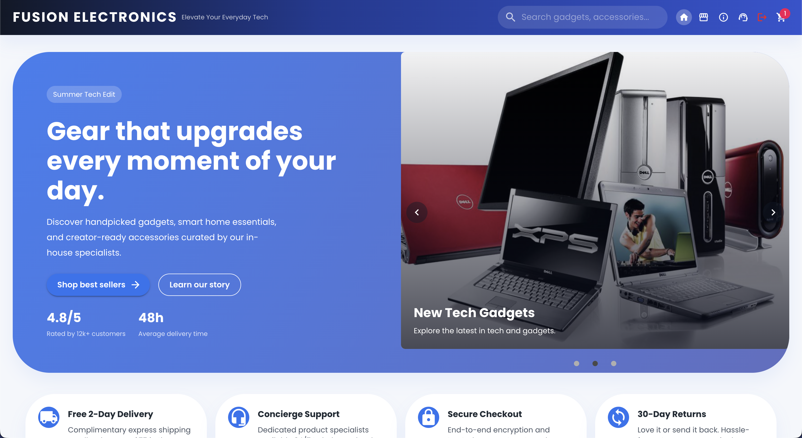
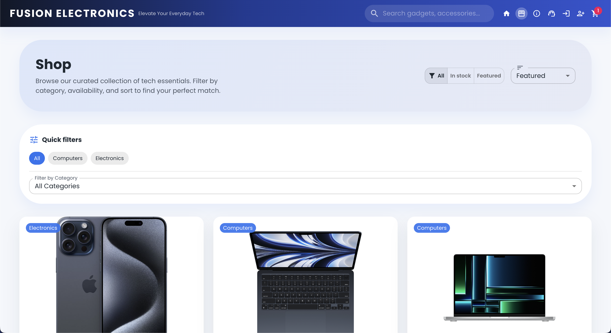
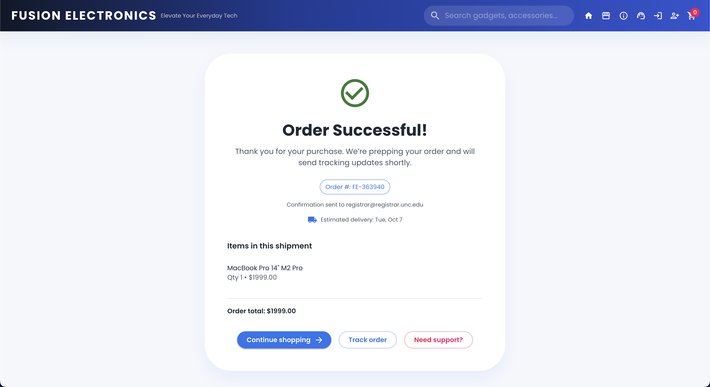

# Fusion Electronics: A MERN-Stack E-commerce Application

Welcome to Fusion Electronics, a MERN-Stack E-commerce Application! This project is a working demo of a full-stack web application that was built using the MERN stack (MongoDB, Express.js, React.js, Node.js). It aims to provide a comprehensive example of building a modern e-commerce platform, covering frontend user interface, backend server logic, database management, and integration with third-party libraries.

## Table of Contents

1. [Introduction](#introduction)
2. [User Interface](#user-interface)
   - [Home Page](#home-page)
   - [Full Product List](#full-product-list)
   - [Cart Page](#cart-page)
   - [Checkout Page](#checkout-page)
3. [Features](#features)
4. [Technologies Used](#technologies-used)
5. [Getting Started](#getting-started)
    - [Prerequisites](#prerequisites)
    - [Installation](#installation)
6. [Project Structure](#project-structure)
7. [Running the Application](#running-the-application)
8. [Deployment](#deployment)
9. [Contributing](#contributing)
10. [License](#license)
11. [Creator](#creator)

## Introduction

This project is a demonstration of building an e-commerce application using the MERN stack, which consists of MongoDB (database), Express.js (server), React.js (frontend), and Node.js (runtime environment). The application allows users to browse products, add them to a shopping cart, proceed to checkout, and simulate the order processing. It includes basic validations for user inputs and simulates the checkout process on the backend.

## User Interface

### Home Page
<p align="center">
    
</p>

### Full Product List

<p align="center">
    
</p>

### Cart Page

<p align="center">
    
</p>

### Checkout Page

<p align="center">
    
</p>

### Order Confirmation

<p align="center">
    
</p>

## Features

- **Product Management:**
    - View a list of products.
    - View detailed product information.
    - Add products to the shopping cart.

- **Shopping Cart:**
    - View items in the shopping cart.
    - Remove items from the cart.
    - Calculate total amount of items in the cart.

- **Checkout Process:**
    - Enter billing, shipping, and payment information.
    - Simulate the order creation process on the backend.
    - Receive confirmation of order success.

## Technologies Used

- **Frontend:**
    - React.js
    - Material-UI for styling
    - Axios for API requests
    - `react-credit-cards-2` for credit card visualization

- **Backend:**
    - Node.js
    - Express.js
    - MongoDB (with Mongoose ODM)
    - Axios for external API requests

- **Development Tools:**
    - Jetbrains WebStorm (IDE)
    - Postman (for API testing)
    - Git (version control)
    - npm (package manager)

## Project Structure

The project is organized into two main "stacks": The backend is in the `backend` directory that hosts all product & order data and the frontend is in the `root` directory. Here is an overview of the project structure:

```
fullstack-ecommerce/
├── backend/                    # Node.js server files
│   ├── config/                 # Configuration files
│   │   ├── db.js               # Database connection
│   ├── models/                 # Mongoose models
│   │   ├── product.js          # Product schema
│   ├── routes/                 # Route handlers
│   │   ├── products.js         # Product routes
│   │   ├── search.js           # Search routes
│   │   ├── checkout.js         # Checkout routes
│   ├── seed/                   # Database seed data
│   │   ├── products.js         # Product seed data
│   ├── .env                    # Environment variables
│   ├── index.js                # Server entry point
├── public/                     # Public assets
│   ├── index.html              # HTML template
│   ├── manifest.json           # Web app manifest
│   ├── favicon.ico             # Favicon
├── src/                        # React.js frontend files
│   ├── components/              # Reusable components
│   ├── dev/                     # Development utilities
│   ├── pages/                   # Page components
│   ├── App.jsx                  # Main application component
│   ├── App.css                  # Main application styles
│   ├── index.js                 # React entry point
│   .gitignore                   # Git ignore file
│   package.json                 # NPM package file
│   jsconfig.json                # JS config file
│   setupProxy.js                # Proxy configuration
```

## Getting Started

### Prerequisites

Before running this project, ensure you have the following installed:

- Node.js (with npm)
- MongoDB (with either local or remote instance)
- Git

### Installation

1. Clone the repository:

   ```bash
   git clone https://github.com/hoangsonww/fullstack-ecommerce.git
   cd fullstack-ecommerce
   ```

2. Install project dependencies:

   ```bash
   # Install server dependencies
   cd backend
   npm install

   # Install client (frontend) dependencies
   cd ..
   npm install
   ```
   
3. Set up the backend:

   - Create a `.env` file in the `backend/` directory and add the following environment variables:
     ```
     MONGO_URI=mongodb://localhost:27017/Ecommerce-Products
     ```
 
    - Ensure that your MongoDB server is running. If you're using Mac, you can start the MongoDB server with the following command:
     ```bash
     brew services start mongodb-community
     ``` 

   - Seed the database with sample data:
     ```bash
     cd backend/seed
     node productSeeds.js
     ```
     
   - Run the backend server: (first `cd` into the backend directory)
     ```bash
     cd ..
     npm start
     ``` 
     
4. Set up the frontend:
   - First, `cd` into the `root` directory if you are not already there:
     ```bash
     cd ..
     ```
     Or
        ```bash
        cd fullstack-ecommerce
        ```
   - Start the frontend development server:
     ```bash
     npm start
     ```

## Running the Application

- Open your browser and navigate to `http://localhost:3000` to view the application.

## Testing the APIs

- Simply open your browser and navigate to `http://localhost:5000/api/products` to view the list of products.
- You can also change the sample data by navigating to `backend/seed/productSeeds.js` and modifying the data there.

## Deployment

To deploy the application:

- Configure deployment settings for both frontend (React) and backend (Node.js) according to your chosen hosting provider (e.g., AWS, Heroku, Netlify).

## Contributing

Contributions to this project are welcome! Here are some ways you can contribute:

- Report bugs and request features by opening issues.
- Implement new features or enhancements and submit pull requests.
- Improve documentation and README files.

## License

This project is licensed under the MIT License - see the [LICENSE](LICENSE) file for details.

## Creator

- **Son Nguyen** - [hoangsonww](https://github.com/hoangsonww)
- **Email:** [info@movie-verse.com](mailto:info@movie-verse.com)

---

Thank you for exploring Fusion Electronics MERN Stack E-commerce Application! If you have any questions or feedback, feel free to reach out and contribute to making this project even better. Happy coding! 🚀
