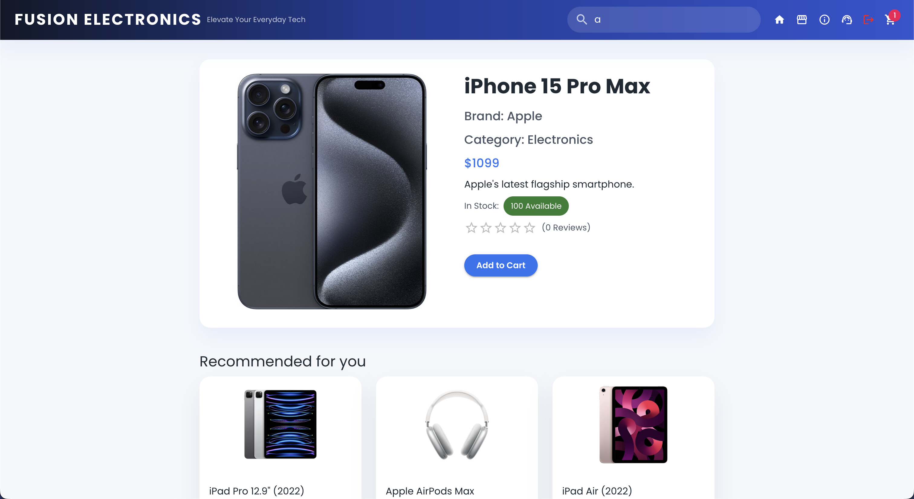
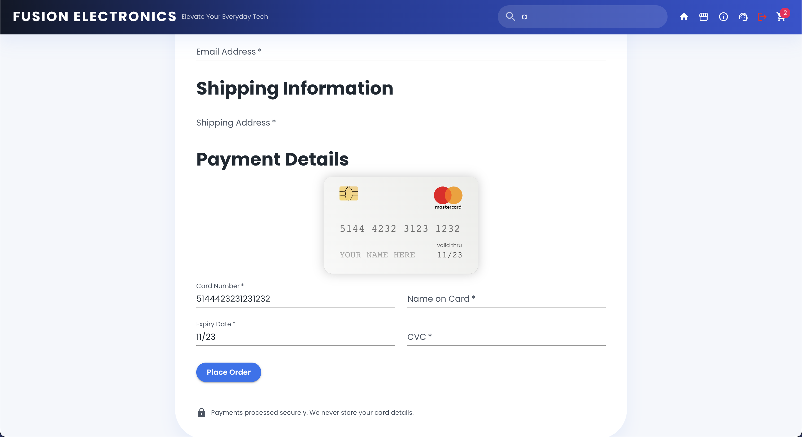

# Fusion Electronics: A MERN-Stack E-commerce Application

Welcome to **Fusion Electronics**, a **MERN-Stack E-commerce Application**! This project is a working demo of a full-stack web application that was built using the MERN stack (MongoDB, Express.js, React.js, Node.js). Additionally, it also includes features such as user authentication, checkout process, product recommendations with vector search, and more!
It aims to provide a comprehensive example of building a modern e-commerce platform, covering frontend user interface, backend server logic, database management, and integration with third-party libraries.

<p align="center">
  <a href="https://fusion-ecommerce-app.vercel.app/" target="_blank">
    
  </a>
</p>

## Table of Contents

1. [Introduction](#introduction)
2. [Live Deployment](#live-deployment)
3. [User Interface](#user-interface)
   - [Home Page](#home-page)
   - [Full Product List](#full-product-list)
   - [Cart Page](#cart-page)
   - [Checkout Page](#checkout-page)
4. [Features](#features)
5. [Technologies Used](#technologies-used)
6. [Getting Started](#getting-started)
    - [Prerequisites](#prerequisites)
    - [Installation](#installation)
7. [Project Structure](#project-structure)
8. [Running the Application](#running-the-application)
9. [Product Recommendations with Vector Database](#product-recommendations-with-vector-database)
10. [Testing the APIs](#testing-the-apis)
11. [Unit & Integration Testing](#unit--integration-testing)
    - [Backend Tests](#backend-tests)
    - [Frontend Tests](#frontend-tests)
12. [Swagger API Documentation](#swagger-api-documentation)
13. [OpenAPI Specification](#openapi-specification)
    - [Using the `openapi.yaml` File](#using-the-openapiyaml-file)
14. [Deployment](#deployment)
15. [Containerization](#containerization)
16. [GitHub Actions & CI/CD](#github-actions--cicd)
17. [Contributing](#contributing)
18. [License](#license)
19. [Creator](#creator)

## Introduction

This project is a demonstration of building an e-commerce application using the MERN stack, which consists of MongoDB (database), Express.js (server), React.js (frontend), and Node.js (runtime environment). The application allows users to browse products, add them to a shopping cart, proceed to checkout, and simulate the order processing. It includes comprehensive validations for user inputs and simulates the checkout process on the backend.

The application is designed to be user-friendly and responsive, providing a seamless shopping experience. It also includes features such as product search, user authentication, and order confirmation. Additionally, it uses Weaviate for product recommendations based on vector search, enhancing the user experience by suggesting relevant products.

<p align="center">
  <a href="https://react.dev">
    
  </a>
  <a href="https://nodejs.org/">
    
  </a>
  <a href="https://expressjs.com/">
    
  </a>
  <a href="https://www.mongodb.com/">
    
  </a>
  <a href="https://jestjs.io/">
    
  </a>
  <a href="https://mui.com/">
    
  </a>
  <a href="https://weaviate.io/">
    
  </a>
  <a href="https://https://ai.meta.com/tools/faiss/">
    
  </a>
  <a href="https://www.langchain.com">
    
  </a>
  <a href="https://www.npmjs.com/">
    
  </a>
  <a href="https://vercel.com/">
    
  </a>
  <a href="https://www.render.com/">
    
  </a>
  <a href="https://swagger.io/">
    
  </a>
  <a href="https://www.docker.com/">
    
  </a>
  <a href="https://jestjs.io/">
    
  </a>
  <a href="https://reactjs.org/">
    
  </a>
  <a href="https://git-scm.com/">
    
  </a>
  <a href="https://www.postman.com/">
    
  </a>
  <a href="https://axios-http.com/">
    
  </a>
  <a href="https://reactrouter.com/">
    
  </a>
  <a href="https://babel.io/">
    
  </a>
  <a href="https://webpack.js.org/">
    
  </a>
  <a href="https://craco.js.org/">
    
  </a>
  <a href="https://react-hook-form.com/">
    
  </a>
  <a href="https://fkhadra.github.io/react-toastify/">
    
  </a>
  <a href="https://www.npmjs.com/package/react-credit-cards-2">
    
  </a>
</p>

## Live Deployment

The application is deployed live on Vercel. You can access it at the following URL: **[Fusion Electronics App](https://fusion-ecommerce-app.vercel.app).**

The **primary** backend server is deployed on Vercel and can be accessed at the following URL: **[Fusion Electronics API](https://fusion-electronics-api.vercel.app/)**.

The **backup** backend server is deployed on Render and can be accessed at the following URL: **[Fusion Electronics API](https://fusion-electronics-api.vercel.app/).**

> [!IMPORTANT]
> **Note**: The backend server may take a few seconds to wake up if it has been inactive for a while. For your information, it is hosted on the free tier of Render, with 0.1 CPU and 512 MB of memory only, so it may take a bit longer to respond to requests, especially after periods of inactivity.

> [!CAUTION]
> **Warning**: We are currently on the free trial of Weaviate. Once we run out of the free credits, the product recommendations feature will not work until we upgrade to a paid plan (but I'm a college student, so I don't have the budget to do that right now...) However, you can still run the application locally and set up your own Weaviate instance to enable product recommendations - please refer to the [Product Recommendations with Vector Database](#product-recommendations-with-vector-database) section for more details.

## User Interface

### Home Page

<p align="center">
    
</p>

### Recommended Products (based on user interaction)

<p align="center">
    
</p>

### Full Product List

<p align="center">
    
</p>

### Search Results

<p align="center">
    
</p>

### Product Details Page

<p align="center">
    
</p>

### Cart Page

<p align="center">
    
</p>

### Checkout Page

<p align="center">
    
</p>

### Login Page

<p align="center">
    
</p>

### Register Page

<p align="center">
    
</p>

### Forgot Password Page

<p align="center">
    
</p>

### Reset Password Page

<p align="center">
    
</p>

### Order Confirmation

<p align="center">
    
</p>

### Footer

<p align="center">
    
</p>

## Features

- **Product Management:**
    - View a list of products.
    - View detailed product information.
    - Add products to the shopping cart.

- **Shopping Cart:**
    - View items in the shopping cart.
    - Remove items from the cart.
    - Calculate total amount of items in the cart.

- **Checkout Process:**
    - Enter billing, shipping, and payment information.
    - Simulate the order creation process on the backend.
    - Receive confirmation of order success.

## Technologies Used

- **Frontend:**
    - React.js
    - Material-UI for styling
    - Axios for API requests
    - `react-credit-cards-2` for credit card visualization
    - `react-router-dom` for routing
    - `react-hook-form` for form validation
    - `react-toastify` for toast notifications
    - Jest and React Testing Library for testing

- **Backend:**
    - Node.js
    - Express.js
    - MongoDB (with Mongoose ODM)
    - Axios for external API requests
    - JsonWebToken for user authentication
    - Bcrypt for password hashing
    - Dotenv for environment variables
    - Cors for cross-origin resource sharing
    - Swagger for API documentation
    - Nodemon for server hot-reloading
    - **Middleware**: JWT for securing API endpoints
    - **Weaviate** for product recommendations with vector database
    - **FAISS & LangChain** for efficient similarity search
    - Jest for unit and integration testing

- **Development Tools:**
    - Jetbrains WebStorm (IDE)
    - Postman (for API testing)
    - Git (version control)
    - npm (package manager)
    - Docker (for containerization)

## Project Structure

The project is organized into two main "stacks": The backend is in the `backend` directory that hosts all product & order data and the frontend is in the `root` directory. Here is an overview of the project structure:

```
fullstack-ecommerce/
├── backend/                       # Node.js server files
│   ├── config/                    # Configuration files
│   │   └── db.js                  # Database connection
│   ├── docs/
│   │   └── swagger.js             # Swagger API documentation setup
│   ├── models/                    # Mongoose models
│   │   ├── user.js                # User schema
│   │   └── product.js             # Product schema
│   ├── routes/                    # Route handlers
│   │   ├── products.js            # Product routes
│   │   ├── search.js              # Search routes
│   │   └── checkout.js            # Checkout routes
│   ├── middleware/                # Middleware functions
│   │   ├── auth.js                # Authentication middleware
│   ├── scripts/                   # Scripts for various tasks
│   │   ├── build-faiss-index.js   # Script to build FAISS index
│   │   ├── search-faiss-index.js  # Script to search FAISS index
│   │   ├── query-weaviate.js      # Script to query Weaviate
│   │   ├── weaviate-upsert.js     # Script to upsert products to Weaviate
│   │   └── sync-weaviate.js       # Script to synchronize products with Weaviate
│   ├── seed/                      # Database seed data
│   │   └── productSeeds.js        # Product seed data
│   ├── weaviateClient.js          # Weaviate client setup
│   ├── faiss.sh                   # FAISS index setup script
│   ├── .env                       # Environment variables
│   └── index.js                   # Server entry point
├── public/                        # Frontend public assets
│   ├── index.html                 # HTML template
│   ├── manifest.json              # Web app manifest
│   └── favicon.ico                # Favicon
├── src/                           # React.js frontend files
│   ├── components/                # Reusable components
│   │   ├── CheckoutForm.jsx       # Checkout form component
│   │   ├── ProductCard.jsx        # Product card component
│   │   ├── NavigationBar.jsx      # Navigation bar component
│   │   ├── OrderConfirmation.jsx  # Order confirmation component
│   │   ├── ProductListing.jsx     # Product listing component
│   │   ├── SearchResults.jsx      # Search results component
│   │   └── ShoppingCart.jsx       # Shopping cart component
│   ├── dev/                       # Development utilities
│   │   ├── index.js               # Development entry point
│   │   ├── palette.jsx            # Color palette
│   │   ├── preview.jsx            # Component preview
│   │   └── useInitials.js         # Initials hook
│   ├── pages/                     # Page components
│   │   ├── Cart.jsx               # Cart page component
│   │   ├── Checkout.jsx           # Checkout page component
│   │   ├── Home.jsx               # Home page component
│   │   ├── ProductDetails.jsx     # Product details page component
│   │   ├── OrderSuccess.jsx       # Order success page component
│   │   ├── ProductDetails.jsx     # Product details page component
│   │   └── Shop.jsx               # Shop page component
│   ├── App.jsx                    # Main application component
│   ├── App.css                    # Main application styles
│   └── index.js                   # React entry point
├── build/                         # Frontend production build files
├── tests/                         # Test files
├── .gitignore                     # Git ignore file
├── package.json                   # NPM package file
├── jsconfig.json                  # JS config file
└── setupProxy.js                  # Proxy configuration
(... and more files not listed here ...)
```

## Getting Started

### Prerequisites

Before running this project, ensure you have the following installed:

- Node.js (with npm)
- MongoDB (with either local or remote instance)
- Git

### Installation

1. Clone the repository:
   ```bash
   git clone https://github.com/hoangsonww/MERN-Stack-Ecommerce-App.git
   cd MERN-Stack-Ecommerce-App  # Fix the path if necessary
   ```

2. Install project dependencies:
   ```bash
   # Install server (backend) dependencies
   cd backend
   npm install
   
   # Note: If you encounter any issues with the backend/package-lock.json not updating, run the following command from root directory:
   npm install --no-workspaces --prefix backend

   # Install client (frontend) dependencies
   cd ..
   npm install
   ```
   
3. Set up the backend:

   - Create a `.env` file in the `backend/` directory and add the following environment variable (replace the URI with your MongoDB connection string):
     ```
     MONGO_URI=mongodb://localhost:27017/Ecommerce-Products
     JWT_SECRET=your_secret_key
     ```
     
     For your information, I am using MongoDB Atlas for this project. You can create a free account and get your connection string from there if you want to deploy the application to the cloud.
 
    - Ensure that your MongoDB server is running. If you're using Mac, you can start the MongoDB server with the following command:
     ```bash
     brew services start mongodb-community
     ``` 

   - Seed the database with sample data:
     ```bash
     cd backend/seed
     node productSeeds.js dev
     ```
     
   - Run the backend server: (first `cd` into the backend directory)
     ```bash
     cd ..
     npm start
     ``` 
     
4. Set up the frontend:
   - First, `cd` into the `root` directory if you are not already there:
     ```bash
     cd ..
     ```
     Or
        ```bash
        cd fullstack-ecommerce
        ```
   - Start the frontend development server:
     ```bash
     npm start
     ```
> [!TIP]
> The frontend server will run on `http://localhost:3000` by default. If you encounter any errors when starting related to the `react-credit-cards-2` package, it is OK to just ignore them as the application will still run correctly.

## Running the Application

- Open your browser and navigate to `http://localhost:3000` to view the application.

## Product Recommendations with Vector Database

The application uses **Weaviate & FAISS** as vector databases/stores to provide product recommendations based on vector search. The product data is indexed in Weaviate, allowing for efficient similarity searches and recommendations.

To set up **Weaviate** for product recommendations, follow these steps:

1. **Sign up for a Weaviate account** at [Weaviate Cloud](https://console.weaviate.io/).
2. **Create a new Weaviate instance** and note the API endpoint.
3. **Get your Weaviate API key** from the Weaviate console.
4. **Update the `.env` file in the `backend/` directory** with your Weaviate API endpoint and API key:
   ```
   WEAVIATE_HOST=https://your-weaviate-instance.weaviate.network
   WEAVIATE_API_KEY=your_weaviate_api_key
   ```
5. **Run the Weaviate client script** to index the product data:
   ```bash
   cd backend
   npm run weaviate-upsert
   ```
6. **Synchronize the product data** with Weaviate by running the following command:
   ```bash
   npm run sync-weaviate
   ```
7. **Start or restart the backend server** to apply the changes:
   ```bash
   npm start
   ```
   
Additionally, to set up FAISS & LangChain for efficient similarity search, you can run the following commands in the `backend/scripts/` directory:
   
1. **Build the FAISS index**:
   ```bash
   cd backend
   node build-faiss-index.js
   ```
   
2. **Search efficiently with LangChain**:
   ```bash
     npm run faiss-search -- "your search text" 5
    ```
   
Replace `"your search text"` with the text you want to search for, and `5` with the number of results you want to retrieve. It should return something like:

```plaintext
🔍 Top 5 results for "your search text 5":

1. id=6874a44ee237afdff3374d27    distance=1.2893
2. id=6874a44ee237afdff3374d25    distance=1.3328
3. id=6874a44ee237afdff3374d23    distance=1.3522
4. id=6874a44ee237afdff3374d2e    distance=1.3739
5. id=6874a44ee237afdff3374d28    distance=1.3753
```

Now, the application will use Weaviate & FAISS & LangChain to provide product recommendations based on vector search. When users view a product, they will see recommended products based on similarity to the viewed product.
Try going to the product details page of any product, and you will see a list of recommended products based on the current product!

> [!TIP]
> For now, the free trial of Weaviate would suffice for testing purposes. However, if you want to run your own Weaviate instance, you can follow the [Weaviate documentation](https://weaviate.io/developers/weaviate/current/getting-started/installation.html) to set it up locally or on a cloud provider.

## Testing the APIs

- Simply open your browser and navigate to `http://localhost:5000/api/products` to view the list of products.
- You can also change the sample data by navigating to `backend/seed/productSeeds.js` and modifying the data there.

## Unit & Integration Testing

We have implemented unit and integration tests for the application using Jest and React Testing Library. To run the tests, follow these steps:

### Backend Tests

```bash
cd backend

# Run backend tests (default mode)
npm run test

# Run frontend tests (watch mode - this will automatically re-run tests on file changes)
npm run test:watch

# Run frontend tests (coverage mode - this will generate a coverage report)
npm run test:coverage
```

### Frontend Tests

```bash
cd .. # if you are still in the backend directory

# Run frontend tests (default mode)
npm run test

# Run frontend tests (watch mode - this will automatically re-run tests on file changes)
npm run test:watch

# Run frontend tests (coverage mode - this will generate a coverage report)
npm run test:coverage
```

> [!NOTE]
> If you encounter any issues when running the tests, ensure that you have run `npm install` in both the `backend` and `root` (frontend) directories to install all necessary dependencies.
>
> Also, if the issue persists, try removing the `node_modules` directory and the `package-lock.json` file in both directories, and then run `npm install` again to reinstall all dependencies.

## Swagger API Documentation

- The backend server includes Swagger API documentation that can be accessed at `http://localhost:5000/api-docs`.
- Before accessing the above URL, ensure that the backend server is running.
- The Swagger UI provides a detailed overview of the API endpoints, request/response schemas, and example requests.
- If you have everything set up correctly, you should see the Swagger UI documentation page:

<p align="center">
    
</p>

## OpenAPI Specification

### Using the `openapi.yaml` File

1. **View the API Documentation**
- Open [Swagger Editor](https://editor.swagger.io/).
- Upload the `openapi.yaml` file or paste its content.
- Visualize and interact with the API documentation.

2. **Test the API**
- Import `openapi.yaml` into [Postman](https://www.postman.com/):
  - Open Postman → Import → Select `openapi.yaml`.
  - Test the API endpoints directly from Postman.
- Or use [Swagger UI](https://swagger.io/tools/swagger-ui/):
  - Provide the file URL or upload it to view and test endpoints.

3. **Generate Client Libraries**
- Install OpenAPI Generator:
  ```bash
  npm install @openapitools/openapi-generator-cli -g
  ```
- Generate a client library:
  ```bash
  openapi-generator-cli generate -i openapi.yaml -g <language> -o ./client
  ```
- Replace `<language>` with the desired programming language.

4. **Generate Server Stubs**
- Generate a server stub:
  ```bash
  openapi-generator-cli generate -i openapi.yaml -g <framework> -o ./server
  ```
- Replace `<framework>` with the desired framework.

5. **Run a Mock Server**
- Install Prism:
  ```bash
  npm install -g @stoplight/prism-cli
  ```
- Start the mock server:
  ```bash
  prism mock openapi.yaml
  ```

6. **Validate the OpenAPI File**
- Use [Swagger Validator](https://validator.swagger.io/):
  - Upload `openapi.yaml` or paste its content to check for errors.

This guide enables you to view, test, and utilize the API. You can generate client libraries, server stubs, and run a mock server using the OpenAPI Specification.

## Deployment

To deploy the application:

- Configure deployment settings for both frontend (React) and backend (Node.js) according to your chosen hosting provider (e.g., AWS, Heroku, Netlify).

## Containerization

This project can be containerized using Docker. First, ensure that Docker Desktop is running on your system. Then, to create a Docker image, run the following command:
```bash
docker compose up --build
```

This command will create a Docker image for the frontend and backend, and run the application in a containerized environment.

## GitHub Actions & CI/CD

This project includes a GitHub Actions workflow for continuous integration and deployment. The workflow is defined in the `.github/workflows/ci.yml` file and will automatically run tests and build the application on every push or pull request.

<p align="center">
    
</p>

## Contributing

Contributions to this project are welcome! Here are some ways you can contribute:

- Report bugs and request features by opening issues.
- Implement new features or enhancements and submit pull requests.
- Improve documentation and README files.

## License

This project is licensed under the **MIT License** - see the [LICENSE](LICENSE) file for details.

## Creator

Fusion Electronics was created with ❤️ by:

- **Son Nguyen** - [hoangsonww](https://github.com/hoangsonww)
- **Email:** [hoangson091104@gmail.com](mailto:hoangson091104@gmail.com).

---

Thank you for exploring **Fusion Electronics - a MERN Stack E-commerce Application**! If you have any questions or feedback, feel free to reach out or open an issue.

**Happy coding! 🚀**
